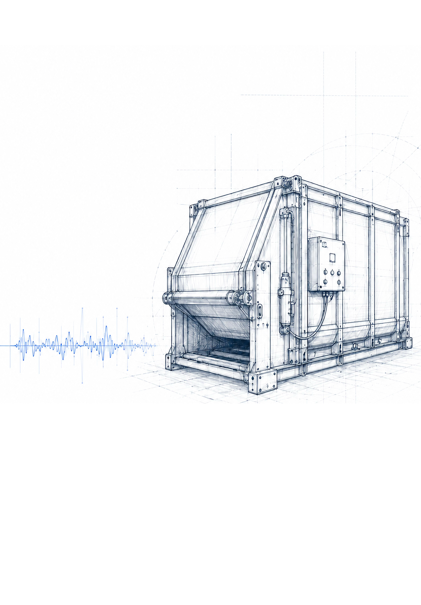
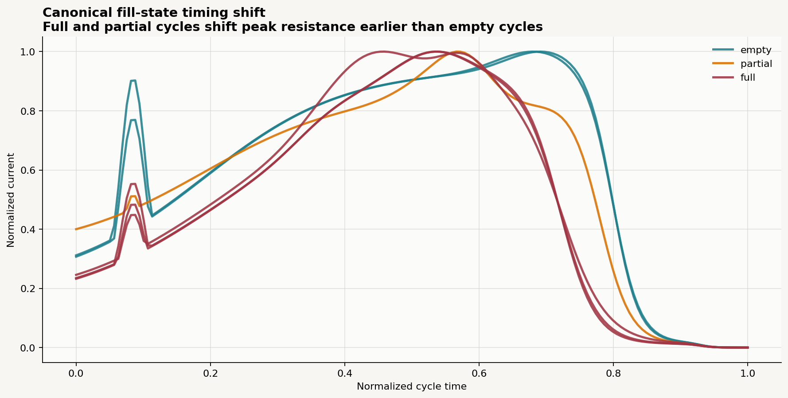
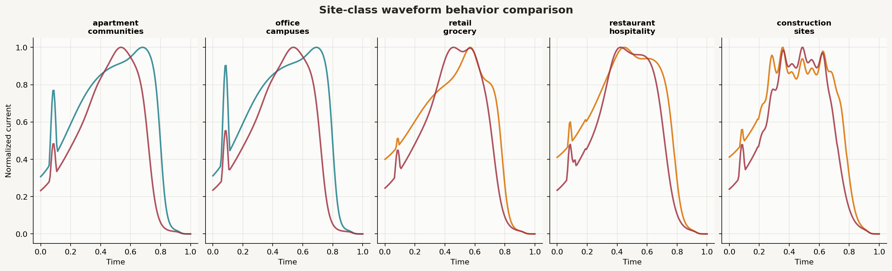

# Industrial Telemetry ML System

> Synthetic telemetry datasets, a production-style technical case study, and runnable inference examples for industrial compactor behavior modeling.



## Overview

This repository is organized around three polished entry points:

| Area | Start here | Why it matters |
|---|---|---|
| **Case study** | [`case-study/README.md`](case-study/README.md) | Explains the system narrative, technical architecture, modeling strategy, and business significance |
| **Sample test data** | [`raw_payload_runs/README.md`](raw_payload_runs/README.md) and [`clean_waveform_benchmark/README.md`](clean_waveform_benchmark/README.md) | Provides synthetic telemetry inputs for parser tests, waveform analysis, and controlled experiments |
| **Inference example** | [`clean_waveform_benchmark/inference_demo.py`](clean_waveform_benchmark/inference_demo.py) | Demonstrates a compact end-to-end prediction flow on known-label waveform features |

## Quick navigation

- **Read the narrative:** [`case-study/README.md`](case-study/README.md)
- **Run the demo:** [`clean_waveform_benchmark/inference_demo.py`](clean_waveform_benchmark/inference_demo.py)
- **Inspect clean benchmark data:** [`clean_waveform_benchmark/`](clean_waveform_benchmark/)
- **Inspect payload-style test data:** [`raw_payload_runs/`](raw_payload_runs/)
- **See the repository inventory:** [`unified_manifest.json`](unified_manifest.json)

## Quick start

### 1. Read the case study

The repository narrative is in [`case-study/README.md`](case-study/README.md), which links to each chapter and major section of the write-up.

### 2. Run the inference example

From the repository root:

```bash
python3 clean_waveform_benchmark/inference_demo.py
```

This prints:

- training/test counts
- prediction accuracy on the synthetic benchmark labels
- example predictions
- a single-record inference example

### 3. Explore the data layers

Use the two datasets for different jobs:

| Dataset | Best for |
|---|---|
| [`raw_payload_runs/`](raw_payload_runs/) | Parser tests, base64 CSV decoding, anomaly scenarios, split/double-run handling |
| [`clean_waveform_benchmark/`](clean_waveform_benchmark/) | Feature engineering demos, clean-label experiments, graph-based explanation, inference walkthroughs |

## Repository highlights

### Case study

The case study documents how electrical telemetry, signal processing, and machine learning can transform industrial compactors into operational intelligence systems.

- 14 chaptered markdown files
- section-level navigation throughout
- dedicated assets folder with diagrams, photos, and waveform illustrations
- polished technical framing for GitHub browsing and sharing

### Sample data

Two complementary synthetic datasets are included:

1. **`raw_payload_runs/`** for payload-like ingestion and parser validation
2. **`clean_waveform_benchmark/`** for labeled waveform inspection and inference demonstrations

Together, they support both **systems testing** and **model explanation**.

### Example code

The repository includes a lightweight Python inference demo that uses engineered waveform features to predict:

- `site_class`
- `fill_state`

The example is intentionally simple so the modeling mechanics are easy to inspect and explain.

## Featured visuals

| System architecture | Signal behavior |
|---|---|
|  |  |

| Model evolution | Site-class waveform behavior |
|---|---|
|  |  |

## Repository structure

```text
industrial-telemetry-ml-system/
├── README.md
├── .gitignore
├── unified_manifest.json
├── case-study/
│   ├── README.md
│   ├── 01_Executive_Summary.md
│   ├── ...
│   ├── 14_Appendix_A.md
│   └── assets/
├── clean_waveform_benchmark/
│   ├── README.md
│   ├── clean_waveform_dataset.json
│   ├── clean_waveform_dataset.jsonl
│   ├── graphs/
│   ├── inference_demo.py
│   └── reference_image_classification.md
└── raw_payload_runs/
    ├── README.md
    ├── all_runs.jsonl
    ├── manifest.json
    ├── schema.json
    ├── scenarios/
    └── validation_summary.csv
```

## Documentation map

| Need | Go here |
|---|---|
| Understand the full system and story | [`case-study/README.md`](case-study/README.md) |
| Review chapter-by-chapter technical details | [`case-study/`](case-study/) |
| Browse clean synthetic benchmark data | [`clean_waveform_benchmark/README.md`](clean_waveform_benchmark/README.md) |
| Browse payload-style parser test data | [`raw_payload_runs/README.md`](raw_payload_runs/README.md) |
| Run the inference walk-through | [`clean_waveform_benchmark/inference_demo.py`](clean_waveform_benchmark/inference_demo.py) |
| Check high-level dataset metadata | [`unified_manifest.json`](unified_manifest.json) |

## Notes

- All included data is synthetic and intended for experimentation, explanation, and testing.
- The case study is the primary narrative artifact for the repository.
- The repository is designed to be browsable directly on GitHub, with README-based navigation at the root and subdirectory level.
