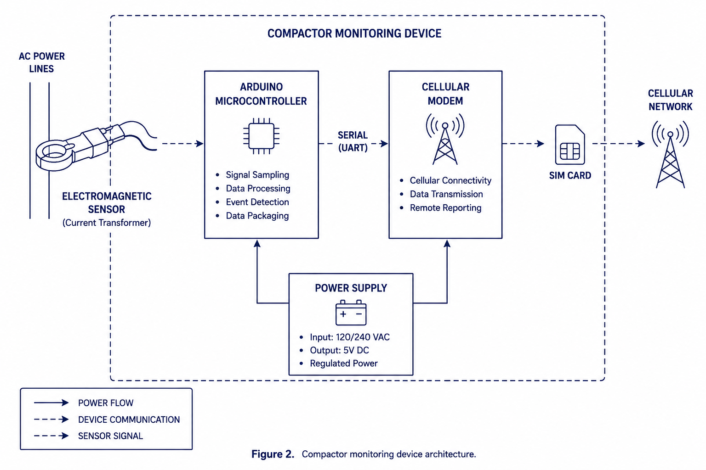
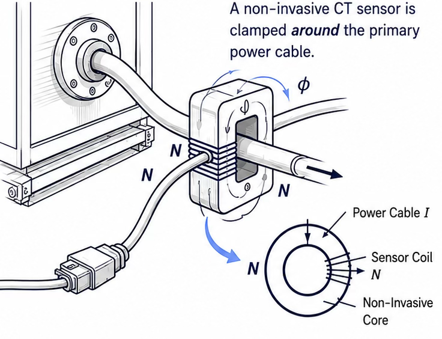

# Industrial Telemetry ML System

## Read The Full Case Study (PDF)

[](The%20Compactor%20Became%20The%20Sensor%20-%20Kiefer%20Waight%20-%20Applied%20Machine%20Learning.pdf)

Direct link: [The Compactor Became The Sensor - Kiefer Waight - Applied Machine Learning.pdf](The%20Compactor%20Became%20The%20Sensor%20-%20Kiefer%20Waight%20-%20Applied%20Machine%20Learning.pdf)

[](case-study/README.md)
[](case-study/README.md)
[](case-study/README.md#deployment-scale)
[](case-study/README.md)

Real-world artificial intelligence and machine learning for industrial telemetry, deployed in active operations across 1,000+ customer locations in 46 states.

This repository centers on a practical, production-proven idea: use non-invasive electromagnetic sensing to turn compactors into continuous operational intelligence systems.

## Latest Case Study Release

- Latest canonical version: [case-study/README.md](case-study/README.md)
- Last updated: May 2026
- Scope: full technical narrative from sensing hardware to dispatch automation and business outcomes

## Why This Repository Stands Out

- Real applied AI and ML, not a toy notebook
- Deployment reality at national scale
- Closed-loop learning with ground-truth feedback from operations
- End-to-end view from signal capture to decision automation

## Featured System Visuals

### 1) End-to-End System Evolution


### 2) Device and Operational Context



### 3) Core Sensing Innovation (Electromagnetic Clamp)



### 4) AI/ML Inference and Signal Intelligence Flow


## Case Study Table of Contents (From the Landing Page)

### Part I - Foundation

- [01 Executive Summary](case-study/01_Executive_Summary.md)
- [02 Core Insight](case-study/02_Core_Insight.md)

### Part II - Technical System

- [03 Technical Architecture](case-study/03_Technical_Architecture.md)
- [04 Signal Modeling](case-study/04_Signal_Modeling.md)

### Part III - The Hard Problems

- [05 Why This Was Hard](case-study/05_Why_This_Was_Hard.md)
- [06 Ground Truth and Labeling](case-study/06_Ground_Truth_and_Labeling.md)
- [07 Model Evolution](case-study/07_Model_Evolution.md)
- [08 Failure Cases](case-study/08_Failure_Cases.md)
- [09 Signal Drift](case-study/09_Signal_Drift.md)

### Part IV - Operational Reality

- [10 Operational Integration](case-study/10_Operational_Integration.md)
- [11 Nationwide Scale](case-study/11_Nationwide_Scale.md)
- [12 Business Outcome](case-study/12_Business_Outcome.md)

### Part V - Strategic Framing

- [13 Strategic Significance](case-study/13_Strategic_Significance.md)
- [14 Appendix A: Public Evidence](case-study/14_Appendix_A.md)

### Deep Section Navigation

For section-level links across all chapters, use the full index in [case-study/README.md](case-study/README.md).

## Quick Start

### Read the full narrative

- [case-study/README.md](case-study/README.md)

### Run the inference example

```bash
python3 clean_waveform_benchmark/inference_demo.py
```

### Explore the supporting datasets

- [clean_waveform_benchmark/README.md](clean_waveform_benchmark/README.md)
- [raw_payload_runs/README.md](raw_payload_runs/README.md)
- [unified_manifest.json](unified_manifest.json)

## Repository Layout

```text
industrial-telemetry-ml-system/
|- README.md
|- unified_manifest.json
|- case-study/
|  |- README.md
|  |- 01_Executive_Summary.md ... 14_Appendix_A.md
|  |- assets/
|- clean_waveform_benchmark/
|  |- README.md
|  |- clean_waveform_dataset.json
|  |- clean_waveform_dataset.jsonl
|  |- graphs/
|  |- inference_demo.py
|- raw_payload_runs/
|  |- README.md
|  |- all_runs.jsonl
|  |- scenarios/
|  |- schema.json
```

## Contact and Research Collaboration

- Email: kiefer.waight@uta.edu
- Focus: industrial AI, machine learning operations, and practical telemetry-driven decision systems

## Notes

- This repository emphasizes practical, deployed AI/ML systems in real operations.
- Included datasets are synthetic and structured for testing, benchmarking, and explanation.
