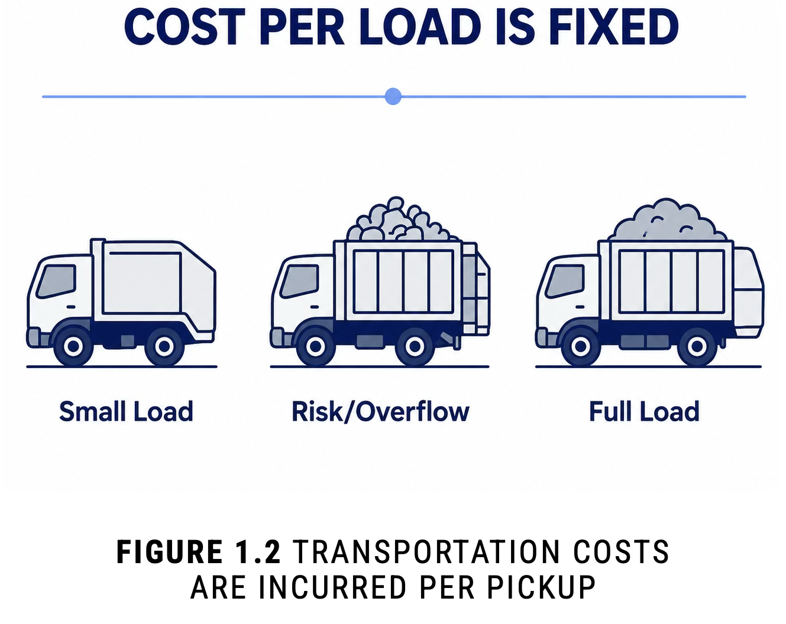
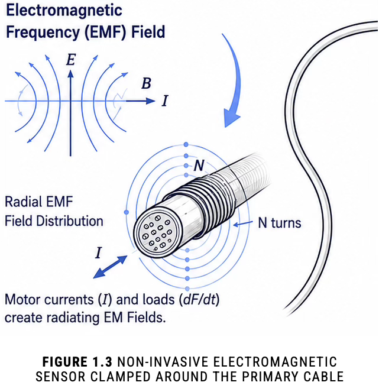

# 01 Executive Summary

The Compactor Became the Sensor

## 1.1 The Business Problem

	

Commercial waste operations had a persistent visibility problem: Dispatch decisions were often made without a reliable real-time view of actual compactor utilization.

In practice, hauling schedules usually depended on a limited set of unreliable operating methods:

| Method                     | Failure Mode                      |
| -------------------------- | --------------------------------- |
| **Fixed schedules**        | Ignores real utilization patterns |
| **Manual inspection**      | Non-scalable and inconsistent     |
| **Overflow response**      | Reactive, service-disruptive      |
| **Vendor heuristics**      | Subjective and non-repeatable     |
| **Conservative servicing** | Systematically over-dispatches    |

	

This created operational inefficiency in both directions.

Trucks were either dispatched before compactors were meaningfully full, or service was delayed until overflow, contamination, emergency pickups, and customer disruption forced action.

This was not a narrow routing problem. It was a recurring operational decision failure that affected cost, service quality, and fleet efficiency across distributed commercial environments.

## 1.2 Technical Strategy

This project approached the problem differently. Instead of installing invasive internal fill-level sensors inside industrial compactors, the system treated the compactor itself as the sensing mechanism.

> The compactor Became The Sensor

	

By analyzing the electrical behavior generated during compaction cycles, including:

- startup load
- current draw
- crush-cycle duration
- compression resistance
- repeated-cycle behavior
- waveform drift

The platform inferred compactor fullness using machine learning and industrial telemetry.

	

This was the central conceptual move of the entire platform.
It reframed the task from direct measurement to state inference: not adding more hardware inside the waste stream, but extracting hidden operational meaning from signals already produced by the equipment.

## 1.3 Research Context and Technical Legitimacy

	

Placed against recent literature, the closest frame for this work is industrial soft sensing rather than ordinary smart waste sensing.

Recent waste-monitoring papers usually begin with direct fill measurement through ultrasonic sensors, event sensors, or manual observation. <a class="cite-tag" href="https://doi.org/10.3390/s20040978">Mel20</a><a class="cite-tag" href="https://doi.org/10.1109/TII.2019.2915572">Rut20</a><a class="cite-tag" href="https://doi.org/10.1177/0734242X231160691">Bro23</a><a class="cite-tag" href="https://doi.org/10.1016/j.biosystems.2019.04.006">Fer18</a><a class="cite-tag" href="https://doi.org/10.1109/ACCESS.2024.3352436">Pol24</a> The closer technical analogues are virtual sensor and soft sensor papers that recover hidden physical state from current, torque, speed, or power traces without adding dedicated measurement hardware. <a class="cite-tag" href="https://doi.org/10.1109/JSEN.2020.3033153">Jia21</a><a class="cite-tag" href="https://doi.org/10.1109/TIM.2023.3273658">Sob23b</a><a class="cite-tag" href="https://doi.org/10.1109/INDIN45523.2021.9557482">Hei21</a>

That makes this case unusual in a useful way. It applied a soft-sensor pattern to commercial waste operations, then connected the result directly to dispatch decisions across a distributed fleet. In that sense, the project sits between industrial inference research and real-world fleet operations rather than within a narrow smart-bin prototype category. <a class="cite-tag" href="https://doi.org/10.1016/j.ymssp.2019.106585">Hen19</a><a class="cite-tag" href="https://doi.org/10.1017/aer.2024.23">Har21</a><a class="cite-tag" href="https://arxiv.org/abs/2112.06986">Jou21</a><a class="cite-tag" href="https://doi.org/10.1109/ACCESS.2025.3556251">Yan25</a>

| Source     | Title                                                                                                                                                                         |
| ---------- | ----------------------------------------------------------------------------------------------------------------------------------------------------------------------------- |
| **Rut20**  | [An Automated Machine Learning Approach for Smart Waste Management Systems](https://doi.org/10.1109/TII.2019.2915572)                                                         |
| **Bro23**  | [Comparison of different waste bin monitoring approaches: An exploratory study](https://doi.org/10.1177/0734242X231160691)                                                    |
| **Fer18**  | [BIN-CT: Urban Waste Collection based in Predicting the Container Fill Level](https://doi.org/10.1016/j.biosystems.2019.04.006)                                               |
| **Pol24**  | [Optimized Operation Management With Predicted Filling Levels of the Litter Bins for a Fleet of Autonomous Urban Service Robots](https://doi.org/10.1109/ACCESS.2024.3352436) |
| **Jia21**  | [A Review on Soft Sensors for Monitoring, Control, and Optimization of Industrial Processes](https://doi.org/10.1109/JSEN.2020.3033153)                                       |
| **Sob23b** | [A Data-Driven Soft Sensor for Mass Flow Estimation](https://doi.org/10.1109/TIM.2023.3273658)                                                                                |
| **Hei21**  | [Indirect Mass Flow Estimation based on Power Measurements of Conveyor Belts in Mineral Processing Applications](https://doi.org/10.1109/INDIN45523.2021.9557482)             |
| **Hen19**  | [A general anomaly detection framework for fleet-based condition monitoring of machines](https://doi.org/10.1016/j.ymssp.2019.106585)                                         |
| **Har21**  | [Distributed digital twins for health monitoring: resource constrained aero-engine fleet management](https://doi.org/10.1017/aer.2024.23)                                     |
| **Jou21**  | [On The Reliability Of Machine Learning Applications In Manufacturing Environments](https://arxiv.org/abs/2112.06986)                                                         |
| **Yan25**  | [Cross-Method Overview of Fleet-Based Machine Health Estimation and Prediction: A Practical Guide for Industrial Applications](https://doi.org/10.1109/ACCESS.2025.3556251)   |

## 1.4 Strategic Significance

The broader significance of the project extended beyond waste operations. The platform demonstrated a larger industrial AI principle:

> Operational intelligence can often be extracted
> from infrastructure that already exists.

Rather than deploying increasingly complex sensor hardware, the system used telemetry, software, and machine learning to interpret hidden signals already embedded within industrial systems.

The commercial outcome validated that approach. The machine-learning codebase and compactor-monitoring logic later became part of a broader waste-technology ecosystem associated with [Quest Resource Holding Corporation](https://investors.qrhc.com/overview/default.aspx), whose public materials emphasize data-driven waste programs, AI-assisted operations, IoT-enabled infrastructure, equipment intelligence, and centralized operational reporting.

Public-facing product evolution aligned closely with the original operational thesis:

- predictive hauling
- real-time fullness intelligence
- cellular telemetry
- automated scheduling
- machine-learning-assisted waste operations

This case demonstrates applied machine learning in a physical industrial system before "industrial AI" became a mainstream framing.

Its enduring value came from four linked sources:

| Source of Value                    | Why It Mattered                                                         |
| ---------------------------------- | ----------------------------------------------------------------------- |
| **Existing infrastructure**        | Avoided invasive retrofits by leveraging equipment already in the field |
| **Real-world signal modeling**     | Extracted useful state from noisy industrial behavior                   |
| **Workflow integration**           | Made predictions operationally meaningful rather than merely analytical |
| **Operational telemetry at scale** | Turned distributed equipment data into automated decision support       |

---

	
<a href="README.md#table-of-contents">Table Of Contents</a>

	<a class="chapter-nav-next" href="02_Core_Insight.md">02 Core Insight &rarr;</a>

