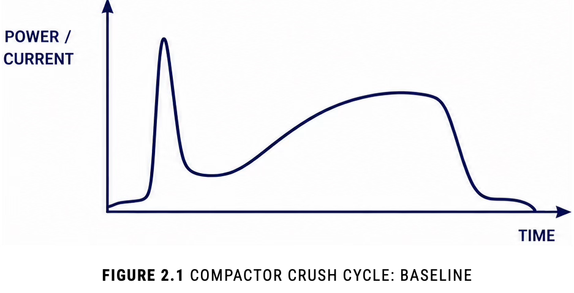
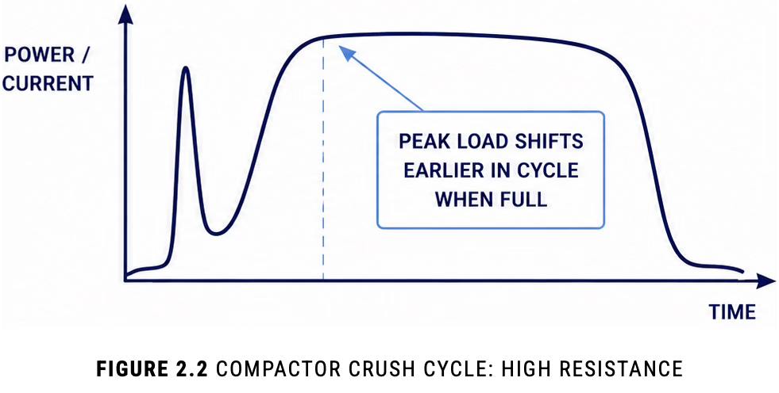
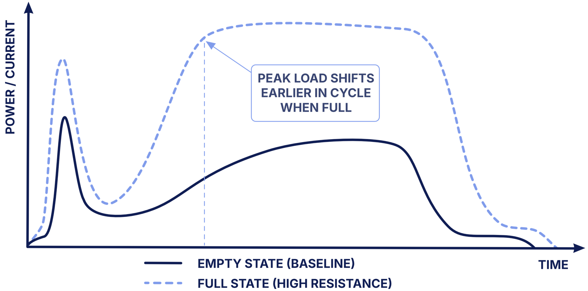
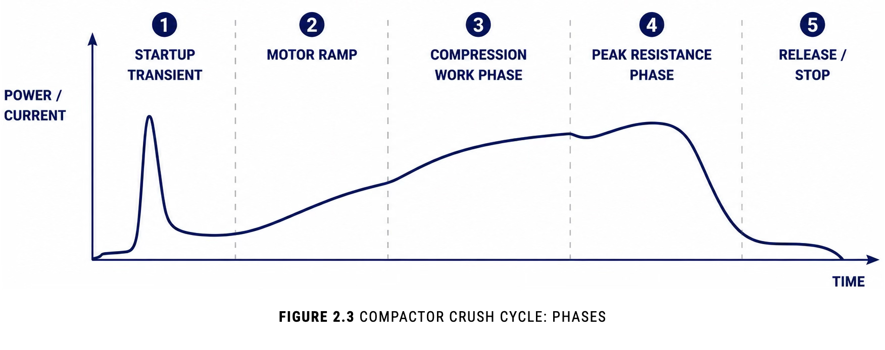
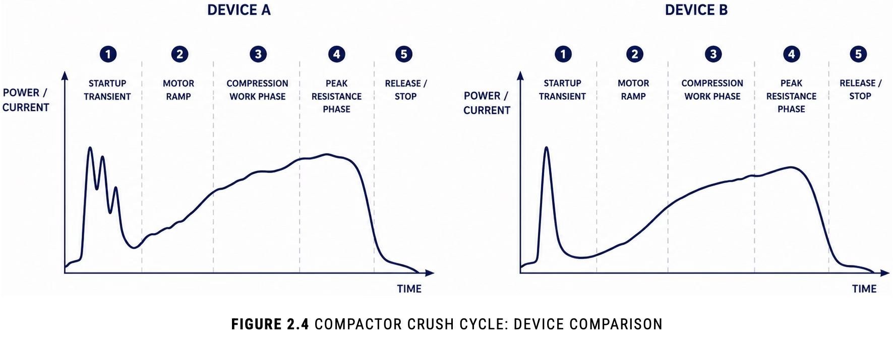
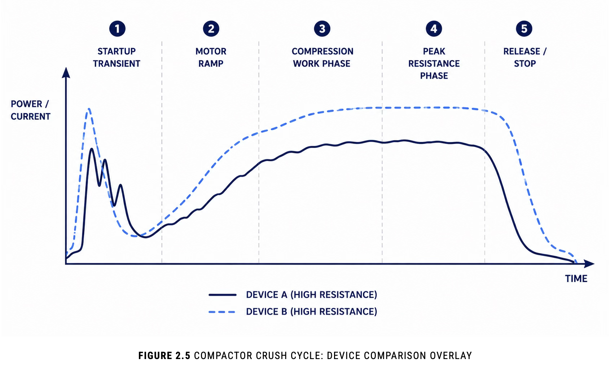
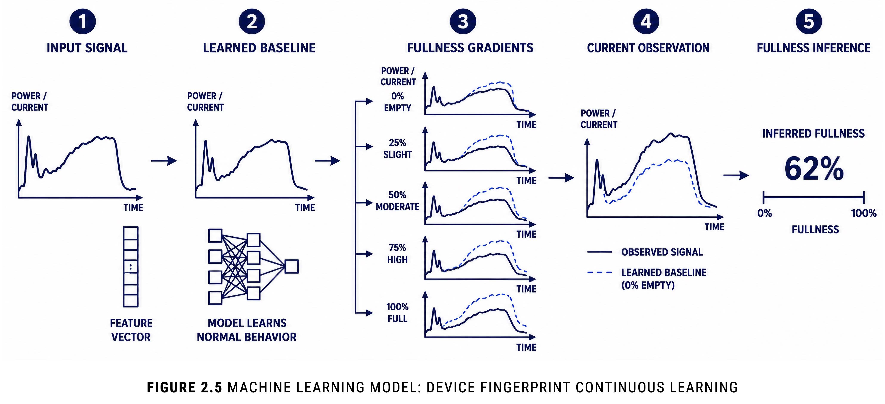

# 02 Core Insight

Operational intelligence can OFTEN be extracted

FROM INFRASTRUCTURE THAT ALREADY EXISTS

## 2.1 The Compactor Already Contained The Signal

The breakthrough was not building a better fill-level sensor. The breakthrough was realizing one was already there.

Industrial trash compactors continuously produce electrical and mechanical signals during operation:

	

- motor startup behavior
- current draw
- crush-cycle duration
- compression resistance
- repeated-cycle frequency
- hydraulic load variation
- cycle-shape drift

Historically, these signals were treated as incidental machine behavior. This project treated them as operational intelligence.

The core insight was deceptively simple:

A compactor behaves differently when it is full.

As material density increased inside the container, the compactor's operational behavior changed in measurable ways.

The machine began to:

	

- draw power differently
- encounter resistance earlier
- sustain longer compression cycles
- repeat crushes more frequently
- produce waveform signatures that drifted away from empty-state behavior
  
The compactor itself already contained the signal.

**The challenge was:**

> Learning how to interpret it.

| Operational Condition  | Electrical Behavior                                              |
| ---------------------- | ---------------------------------------------------------------- |
| **Empty compactor**    | Short, smooth, low-resistance cycle                              |
| **Moderately full**    | Earlier resistance buildup and longer compression duration       |
| **Near capacity**      | Sustained load, repeated crush behavior, waveform distortion     |
| **Dense obstruction**  | Sharp resistance spikes and abnormal cycle characteristics       |
| **Mechanical anomaly** | Irregular or drifting signal patterns inconsistent with fullness |

## 2.2 A Crush Cycle Became A Signal

A crush cycle became analogous to a signal-processing problem.

Instead of treating compaction as a binary event, the system treated each cycle as a waveform evolving over time. The telemetry pipeline analyzed:

- startup spikes -> ramp curves -> sustained-load behavior -> cycle timing -> repeated-cycle patterns

Each cycle exhibited a consistent structure:

- a startup transient
- a ramp into resistance
- a sustained compression phase
- a peak resistance region
- a release

As fullness increased, the shape of this waveform changed:

- peak resistance occurred earlier
- sustained-load regions extended
- cycle duration increased
- repeated cycles became more frequent

The problem was no longer:

> How full is the container?

It became:

> What does this machine's behavior indicate about internal resistance?

## 2.3 Behavior Had To Be Learned, Not Defined

One of the most important realizations was that no universal "fullness signature" existed.

Every compactor behaved differently.

A waveform indicating 90% fullness on one machine could resemble a 40% cycle on another.

The system therefore had to learn:

- relative behavior
- localized baselines
- machine-specific patterns
- operational drift over time

This transformed the problem from a rules-based system into a machine learning system.

Behavior was normalized against:

- machine history
- site history
- cycle distributions
- observed operational outcomes

Each compactor effectively developed its own operational profile.

Fullness was not defined by a fixed threshold.

It was inferred as a deviation from learned normal behavior.

The intelligence did not emerge from a single threshold. It emerged from learning the behavioral shape of the machine over time.

## 2.4 The System Learned More Than Fullness

As the models matured, the platform began identifying signals beyond simple fullness estimation.

The telemetry also exposed indicators related to:

- compaction resistance trends
- abnormal cycle behavior
- repeated unsuccessful crush attempts
- equipment strain
- operational anomalies
- changing site conditions

The system evolved from:

> Is the compactor full?

to:

> What is the operational state of this asset?

This marked a shift from container monitoring to behavioral intelligence.

## 2.5 The Insight Extended Beyond Waste Operations

The significance of the insight extended beyond waste operations.

> Many industrial systems already emit meaningful
> operational signals

The challenge is often not collecting more data.

The challenge is recognizing that:

- the signal already exists
- the system already produces telemetry
- hidden behavior can be modeled

The compactor became the sensor because the infrastructure already contained the information required to infer operational state.

Machine learning made that signal legible.

---

	
<a href="README.md#table-of-contents">Table Of Contents</a>

	<a class="chapter-nav-prev" href="01_Executive_Summary.md">&larr; 01 Executive Summary</a>
	<a class="chapter-nav-next" href="03_Technical_Architecture.md">03 Technical Architecture &rarr;</a>

