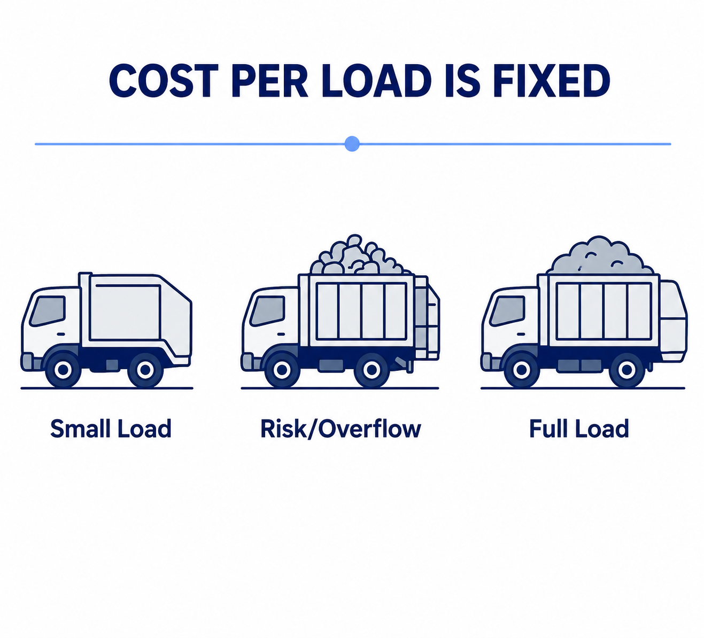
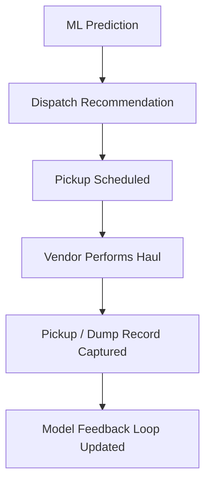
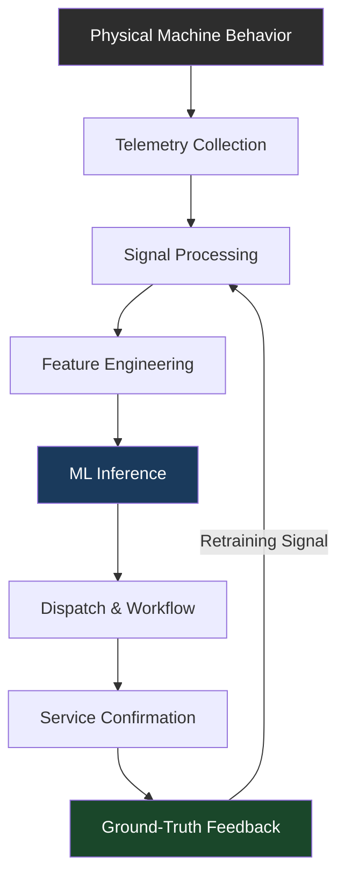

# 03 — Technical Architecture
## From Electrical Noise to Operational Intelligence

---

### 3.1 System Overview

The system was designed as a full-stack industrial intelligence pipeline. Its purpose was not simply to collect compactor data. Its purpose was to convert raw machine behavior into a business decision:

> **Should this compactor be serviced now?**

To achieve that, the architecture connected physical equipment, cellular telemetry, signal processing, machine learning, and operational workflows into a single closed-loop system.

---

### 3.2 Telemetry Collection

The first layer captured operational behavior from the compactor without installing a traditional internal fill-level sensor.

The system monitored electrical and operational signals associated with compactor crush cycles.

**Captured signals included:**
- Voltage behavior
- Current draw
- Startup spikes
- Cycle duration
- Runtime events
- Repeated-cycle patterns

The telemetry device acted as the bridge between industrial equipment and cloud infrastructure. It transformed the compactor from a standalone mechanical asset into a connected, data-producing system.

---

### 3.3 Cellular Transport and Ingestion

Compactors were distributed across diverse environments, requiring a network layer capable of supporting geographically dispersed assets. Cellular telemetry allowed each device to transmit operational data without depending on local infrastructure.

# 03 — Technical Architecture
*From Electrical Noise to Operational Intelligence*

---

## 3.1 System Overview

The system was designed as a **full-stack industrial intelligence pipeline**. Its purpose was not simply to collect compactor data. Its purpose was to convert raw machine behavior into a business decision:

> **Should this compactor be serviced now?**

To achieve that, the architecture connected physical equipment, cellular telemetry, signal processing, machine learning, and operational workflows into a single **closed-loop system**.

---

## 3.2 Telemetry Collection

The first layer captured operational behavior from the compactor without installing a traditional internal fill-level sensor.

The system monitored electrical and operational signals associated with compactor **crush cycles**.

**Captured signals included:**
- Voltage behavior
- Current draw
- Startup spikes
- Cycle duration
- Runtime events
- Repeated-cycle patterns

The **telemetry device** acted as the bridge between industrial equipment and cloud infrastructure. It transformed the compactor from a standalone mechanical asset into a connected, data-producing system.

---

## 3.3 Cellular Transport and Ingestion

Compactors were distributed across diverse environments, requiring a network layer capable of supporting geographically dispersed assets. **Cellular telemetry** allowed each device to transmit operational data without depending on local infrastructure.

**Deployment environments included:**
- Apartment complexes
- Commercial properties
- Office campuses
- Industrial facilities
- Hospitality sites
- Construction sites
- Remote service locations

The ingestion layer was designed to handle **intermittent connectivity**, burst traffic, and delayed event arrival.

The architecture separated **data ingestion** from downstream processing to tolerate these operational realities.

---

## 3.4 Raw Event Storage

The system preserved raw operational telemetry as a historical record. Model accuracy depended on comparing current behavior against prior behavior for the same compactor.

**This layer enabled:**
- Longitudinal analysis
- Baseline establishment
- Drift detection

Each compactor was treated as an **individual system** rather than forced into a universal model.

---

## 3.5 Signal Processing

Raw telemetry from industrial equipment was inherently noisy. The processing layer converted continuous electrical signals into structured, analyzable events.

The most critical transformation was **cycle segmentation** — treating compaction as discrete operational events instead of undifferentiated signal streams.

---

## 3.6 Feature Engineering

The machine-learning system required features that translated physical behavior into model-ready inputs.

**Key feature categories included:**
- **Load characteristics** — peak, average, and sustained load measurements
- **Temporal patterns** — cycle duration and spacing between events
- **Waveform shape** — resistance curves and ramp behavior
- **Repetition signals** — cycle retries and unresolved resistance
- **Drift indicators** — deviation from historical baseline

These features enabled comparison across the compactor's own history and similar devices in comparable environments.

> The system did not measure a single variable. It interpreted patterns across multiple dimensions.

---

## 3.7 Device Fingerprint Normalization

Each compactor exhibited a unique electrical and operational profile.

**Variability arose from:**
- Vendor differences
- Motor configuration
- Equipment age
- Hydraulic condition
- Power supply
- Installation environment
- Maintenance history
- Container size
- Site-specific usage patterns

The system established a **device baseline** for each unit — capturing typical empty-cycle duration, normal startup behavior, expected load range, characteristic waveform shape, standard cycle frequency, and historical drift patterns.

This enabled the model to ask a more meaningful question:

> *"Is this cycle abnormal relative to this specific compactor's own history?"*
> rather than:
> *"Does this cycle exceed a global threshold?"*

---

## 3.8 Machine Learning Inference

The inference layer converted engineered features into operational predictions.

**Primary outputs included:**
- Estimated fullness
- Projected full date
- Confidence threshold
- Pickup recommendation

> Predictions were only valuable if they supported decisions.

---

## 3.9 Dispatch and Workflow Automation

The system connected predictions to operational workflows.

**Supported actions included:**
- Pickup scheduling
- Dispatch timing
- Account manager review
- Notification systems
- Vendor coordination
- Service confirmation
- Reporting

This transformed the platform from **passive monitoring** into **active operational control**.

---

## 3.10 Administrative Interface

An administrative layer provided visibility and control to internal stakeholders.

**Capabilities included:**
- Device overview and status
- Operational history
- Threshold configuration
- Notification management
- Service-provider records
- Location metadata
- User roles and access control
- Reporting

The interface translated technical outputs into operational language: how full the compactor is, when it is expected to be full, whether service is required, and whether attention is needed.

---

## 3.11 Ground-Truth Feedback Loop

The most critical architectural component was the **learning loop**.

Each real-world service event generated a training signal.

**Feedback sources included:**
- Vendor pickup confirmations
- Dump records
- Reported fullness
- Tonnage data
- Service timing
- Account-manager corrections
- Exception notes

> This closed-loop structure distinguished the system from traditional telemetry platforms. It did not simply observe behavior. It **learned from outcomes**.

---

## 3.12 Architecture Summary

The architecture succeeded because it unified the full intelligence pipeline into a single continuous system:

Machine learning was not an isolated analytical layer. It was **embedded within an operational system** where industrial equipment, data infrastructure, predictive models, and business workflows continuously informed one another.

> The technical achievement was not just predicting fullness. It was building a production intelligence system where **sensing, inference, and action** formed a continuous loop.

---

*Previous: [02 — Core Insight](02_Core_Insight.md) | Next: [04 — Signal Modeling](04_Signal_Modeling.md)*
