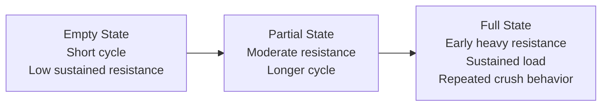
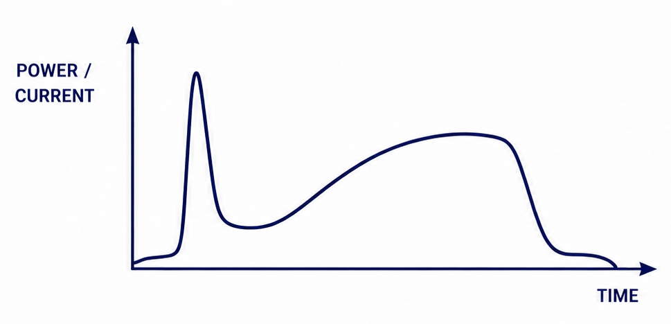
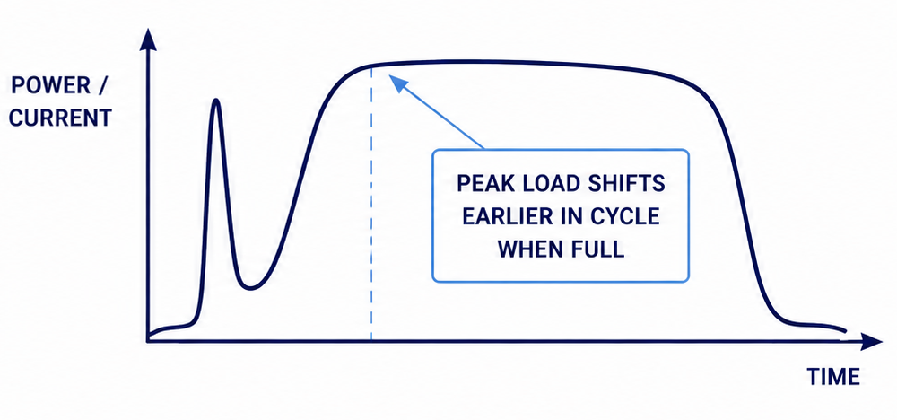
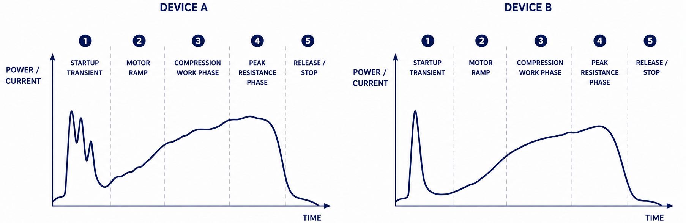
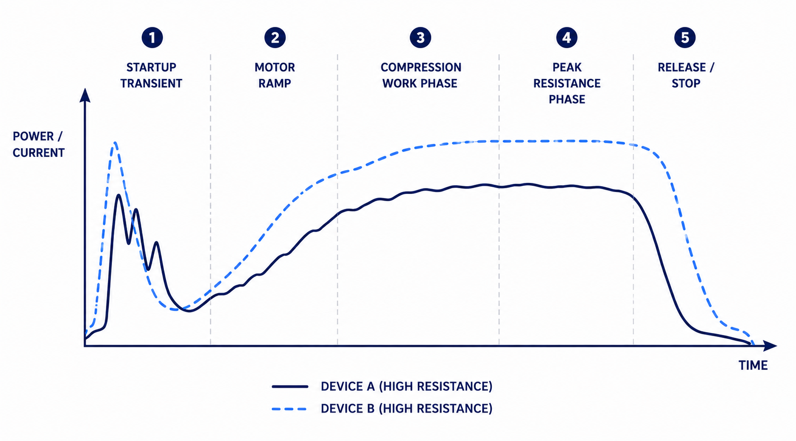
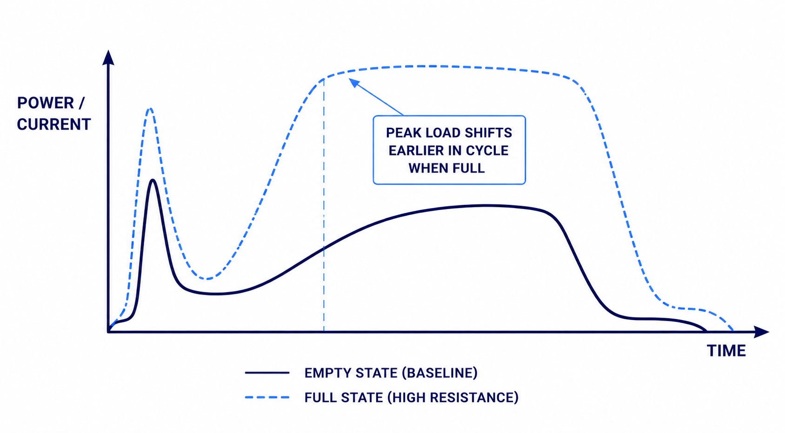
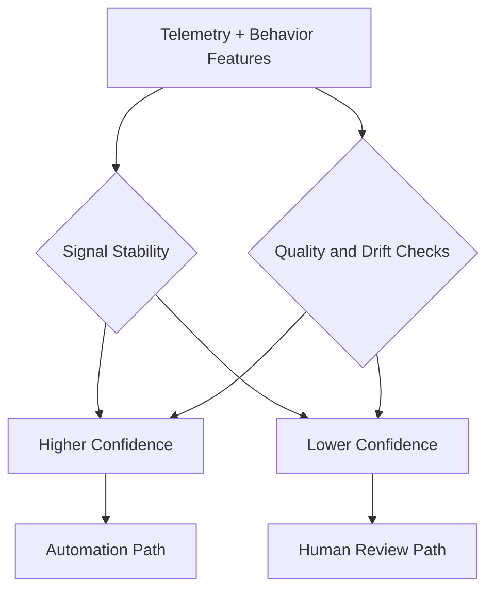

# 04 - Signal Modeling: Reading Industrial Behavior as a Time-Series System

The machine-learning problem began with a fundamental constraint:

> **There was no direct measurement of fullness.**

The system could not ask the compactor: *"How full are you?"*

Instead, it had to infer fullness indirectly from the machine's electrical and operational behavior. This transformed the problem into a **signal-modeling challenge**.

The platform needed to:

- Observe noisy industrial telemetry
- Isolate meaningful operational patterns
- Normalize inconsistent equipment behavior
- Convert crush-cycle characteristics into predictive operational intelligence

At its core, **the system treated every compactor run as a waveform**.

## 4.1 Understanding the Crush Cycle

Every compactor cycle generated a distinct electrical signature. A simplified crush cycle typically contained:

```text
Motor Startup -> Initial Current Spike -> Compression Ramp
    -> Sustained Resistance -> Compression Completion -> Motor Release / Recovery
```

Even visually, the waveform behavior changed as the compactor approached capacity.

**An empty compactor produced:**

- Short cycles
- Low sustained resistance
- Smooth compression curves
- Predictable timing

**A full compactor behaved differently:**

- Resistance appeared earlier
- Load sustained longer
- Current curves distorted
- Cycles extended
- Repeated crush attempts became more common

The challenge was learning how to separate meaningful operational patterns from normal industrial noise.



## 4.2 The Startup Spike Problem

One of the earliest modeling challenges was the **motor startup spike**.

Every compactor generated a large electrical spike when the motor first engaged. This startup behavior was not itself a reliable fullness signal. Without proper handling, the system could falsely interpret startup load as compression resistance.

The startup event had to be **isolated** from the actual compression phase.

> In one early deployment, unusually large motor-start current repeatedly resembled resistance onset. Segmentation review confirmed the apparent load event was activation behavior, not compression resistance. Separating startup-phase handling from sustained-load interpretation materially reduced false positives from startup artifacts.

This required:

- Cycle segmentation
- Temporal filtering
- Normalization against historical startup behavior for the specific compactor

The system learned to distinguish **motor activation** from **material resistance**. That distinction became foundational to downstream feature quality.

## 4.3 Empty-State Baselines

The first stable modeling anchor was the **empty-cycle baseline**.

When a compactor was relatively empty, crush cycles exhibited:

- Minimal sustained resistance
- Smooth power curves
- Short runtime duration
- Low waveform variance

These empty-state runs established the compactor's normal operating profile. This baseline became the foundation for comparative analysis.

The system was not trying to determine: *"What does full look like universally?"*

It was trying to determine: *"How different is this cycle from this compactor's known normal behavior?"*

## 4.4 Resistance Curves Became Predictive

As fullness increased, the crush cycle changed shape. Resistance appeared earlier in the compression sequence. The compactor spent more time under sustained load.

**A generalized progression:**

| **State** | **Key Signal Behavior** | **Operational Interpretation** |
|---|---|---|
| **Empty** | Low resistance | Short cycle |
| **Partial** | Moderate resistance | Longer cycle |
| **Full** | Early heavy resistance + sustained load | Repeated crush behavior |

This became one of the strongest predictive signals. The model learned that **resistance timing**, **resistance duration**, and **resistance intensity** often mattered more than peak current alone.

> *The shape of the curve became more important than a single reading.*




## 4.5 Cycle Duration Was a Strong Behavioral Signal

Cycle runtime became one of the most interpretable predictors.

As compaction difficulty increased:

- Runtime extended
- Compression slowed
- Repeated pushes occurred
- Recovery behavior changed

Longer cycles frequently correlated with increased density, higher fill state, or abnormal resistance conditions.

However, duration alone was insufficient. Some compactors naturally operated slowly due to hydraulic configuration, age, mechanical wear, or vendor-specific characteristics.

**The system therefore modeled duration relative to the device's own history** rather than against a global threshold.

## 4.6 Repeated Crush Attempts

One of the strongest fullness indicators emerged from **repeated compression behavior**.

When material resisted compaction:

- Users often initiated multiple crushes
- Automatic retry behavior occurred
- Operators repeatedly triggered cycles attempting to gain additional capacity

This created a behavioral pattern that strongly correlated with approaching fullness.

**The system began tracking:**

- Cycle frequency
- Repeated runtime bursts
- Short-interval retries
- Cycle clustering

A simplified contrast:

```text
Single Cycle Pattern:
|  |  |  |  |_____|

Repeated Resistance Pattern:
|  |  |  |  |  |  |  |  ||||||______
```

> At one apartment deployment, repeated-cycle bursts consistently preceded confirmed service need by a stable interval. A nearby construction site produced similar bursts, but the pattern collapsed quickly after debris shifted. The contrast reinforced that repeated attempts were informative only when persistence and site context aligned.

This pushed the model toward **persistence checks** over isolated burst counts.

## 4.7 Feature Engineering Beyond Raw Current

The platform eventually evolved beyond direct electrical measurements. Raw telemetry became derived behavioral features.

**Key engineered features included:**

- Resistance onset timing (relative to cycle start)
- Load persistence duration (sustained vs. transient)
- Cycle-over-cycle delta (change from previous run)
- Behavioral momentum (trend direction and rate)
- Anomaly divergence (deviation from site-specific norm)

The system increasingly behaved less like **threshold logic** and more like **behavioral interpretation**.

## 4.8 Device Fingerprinting

One of the hardest modeling problems was **compactor uniqueness**.

No two compactors behaved identically. Differences emerged from motor characteristics, electrical supply, hydraulic pressure, compactor age, maintenance condition, installation quality, and manufacturer differences.

> **Two compactors at the same fullness level could produce dramatically different raw telemetry.**

The solution was **device fingerprinting**. Each compactor developed its own learned behavioral profile. The model tracked normal empty-state cycles, historical resistance patterns, expected runtime ranges, and site-specific usage behavior.

The system therefore learned **relative change, not absolute values**. This was a critical architectural decision. Without normalization, false positives would have overwhelmed the system.



## 4.9 Site-Type Segmentation

The waste stream itself introduced another major source of complexity. Different locations generated fundamentally different compaction behavior.

**Apartments and Office Sites**

These sites produced the cleanest models. Waste composition was relatively consistent - bags, packaging, food waste, paper products - with predictable daily patterns. Waveforms were smooth and repeatable.

> One office deployment and one construction deployment produced similar peak current values in the same week but opposite outcomes. The office site was genuinely near threshold, while the construction site retained substantial capacity after debris collapse. That comparison reinforced site-type segmentation and relative behavioral baselining.

**Industrial Facilities**

Industrial environments generated more difficult signals. Dense materials could create sudden resistance spikes, abnormal crush durations, irregular waveform behavior, and inconsistent density patterns.

**Construction Sites**

Construction deployments produced some of the most difficult false positives. Large structural debris could wedge unevenly, resist initial compression, then suddenly collapse after multiple crushes.

```text
Cycle 1 -> High resistance
Cycle 2 -> High resistance
Cycle 3 -> Structural collapse
Cycle 4 -> Suddenly low resistance
```

These environments forced the models to learn persistence patterns, resistance consistency, and repeated-cycle resolution behavior.



## 4.10 Signal Drift

Physical systems do not remain static.

Compactor behavior drifted over time due to hydraulic wear, motor degradation, maintenance events, occupancy changes, seasonality, and changing waste composition.

A model trained six months earlier could become unreliable if drift was ignored.

The platform therefore continuously recalibrated against recent cycle history, moving averages, behavioral distributions, and changing variance patterns.

> **This made the system adaptive rather than fixed.**

## 4.11 Ground Truth Was the Hardest Part

The platform still needed labels. A waveform alone could not confirm: *"Was the compactor actually full?"*

Ground truth came from operations. The system correlated telemetry against pickup events, dump records, account-manager review, fullness confirmations, tonnage reports, and operational outcomes.

This transformed operational activity into supervised learning data.

The feedback loop gradually improved feature weighting, confidence scoring, anomaly detection, and site-specific prediction quality.



## 4.12 Confidence Scoring

Not every prediction deserved equal trust.

The platform eventually incorporated **confidence scoring** to determine whether predictions were stable, whether the compactor was behaving normally, and whether operational intervention should occur automatically or require review.

**Confidence decreased when:**

- Signal variance increased
- Telemetry quality degraded
- Behavior diverged from historical norms
- Known false-positive patterns appeared



This became operationally important because the system needed to support **automation where confidence was high, and human oversight where ambiguity remained**.

## 4.13 The Modeling Shift

The project began as:
*"Can electrical telemetry estimate fullness?"*

It evolved into:
*"Can machine behavior be interpreted as operational state?"*

That distinction changed the entire modeling approach. The platform was no longer analyzing isolated readings. It was modeling:

> behavior, resistance, rhythm, drift, anomaly, and physical interaction between machinery and material.


The compactor became a continuously evolving industrial signal system.

The machine-learning challenge was not recognizing trash. The challenge was **learning how physical resistance expresses itself through electrical behavior over time**.

*Previous: [03 — Technical Architecture](03_Technical_Architecture.md) | Next: [05 — Why This Was Hard](05_Why_This_Was_Hard.md)*
