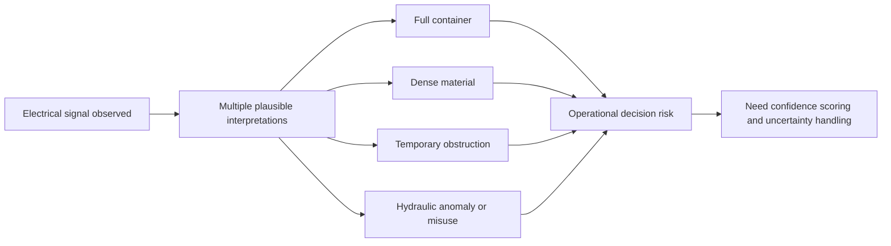

# Chapter 05: Why This Was Hard
## The Problem Looked Simpler Than It Was

At first glance, the project appeared straightforward:

```text
Read electrical behavior -> Estimate fullness -> Schedule pickup
```

In practice, almost every part of that pipeline contained ambiguity.

The system was attempting to infer physical state from indirect electrical behavior inside noisy industrial environments operating under constantly changing conditions. Nothing about the problem was clean.

There was:
- No direct fullness sensor
- No consistent compactor behavior
- No stable waste stream
- No reliable universal thresholds
- No perfectly labeled training data

> The challenge was not simply building a model. The challenge was making uncertain industrial behavior **operationally trustworthy**.



## 5.1 There Was No Ground Truth Sensor

Most machine-learning systems begin with reasonably clear labels. This project did not.

The system could not directly observe:
- Fullness percentage
- Material volume
- Actual internal container geometry

The only available signal was indirect machine behavior. The model therefore had to infer physical resistance, material density, and operational state **without seeing the actual contents of the compactor**.

This created a fundamental ambiguity. High resistance could mean:
- Full container
- Dense material
- Temporary obstruction
- Wet waste
- Cardboard bridging
- Construction debris
- Hydraulic anomaly
- Operator misuse

The telemetry never explicitly stated: *"The compactor is full."*

> At one site, a high-resistance sequence initially looked like near-capacity fullness, then normalized after dense material shifted under repeated compression. The telemetry was accurate, but the interpretation was wrong without context. This incident captured the core ambiguity of indirect inference.

The system had to learn **probabilistic interpretation** from noisy operational outcomes.

## 5.2 Every Compactor Behaved Differently

One of the hardest realities emerged early: there was no universal compactor model.

Every deployment behaved differently due to vendor, motor configuration, hydraulic systems, installation quality, electrical supply, maintenance condition, age, container size, and operational wear.

**Even two identical vendor models could generate dramatically different waveforms** after years of independent field usage. A threshold that worked perfectly on one site could fail entirely on another.

Raw values alone were nearly meaningless. The system therefore had to learn relative behavior, individualized baselines, and compactor-specific drift.

This transformed the problem from "classification" into **"continuous behavioral interpretation."**

## 5.3 Waste Is Not a Stable Material

The waste stream itself introduced major unpredictability. Unlike many industrial ML environments, the underlying physical input was chaotic.

Different sites generated radically different material behavior. Construction environments were particularly difficult. Large debris could:
- Jam unevenly
- Create temporary resistance walls
- Suddenly collapse after multiple crushes

The telemetry often resembled a "full" signal before the obstruction broke apart.

```text
Cycle 1 -> extreme resistance
Cycle 2 -> extreme resistance
Cycle 3 -> sudden structural collapse
Cycle 4 -> low resistance again
```

Without context, the system could incorrectly classify these events as stable fullness conditions. The models therefore needed temporal persistence logic, multi-cycle analysis, and confidence scoring.

## 5.4 Human Behavior Introduced Noise

The system was not only modeling machinery. It was also modeling **operator behavior**.

Different sites used compactors differently. Examples included:
- Repeated unnecessary crushes
- Irregular scheduling habits
- Compaction triggered "just in case"
- Operators attempting to force additional capacity
- Delayed pickups despite alerts
- Inconsistent maintenance practices

Human workflows distorted telemetry patterns. A compactor might appear highly active because the site was truly full, or because one employee repeatedly initiated cycles.

The system therefore needed to distinguish **operational urgency** from **behavioral inconsistency**.

## 5.5 Labels Were Delayed and Imperfect

The most difficult machine-learning problem was not feature engineering. It was **labeling**.

The system rarely received immediate confirmation that a prediction was correct. Ground truth arrived later through pickup records, dump reports, vendor activity, account-manager review, and operational outcomes.

Even those labels were imperfect. A pickup might occur early, late, partially full, or under non-standard conditions.

Sometimes a compactor was serviced because:
- The site manager requested it
- The vendor was nearby
- The schedule required it
- Overflow risk was feared

That meant the operational label did not always perfectly represent actual fullness.

> In another case, model warnings appeared days before service because vendor scheduling lagged the recommended window. When pickup finally occurred, the label timing obscured whether the model had been early, accurate, or late. This incident highlighted why delayed supervision complicated straightforward model evaluation.

The system therefore learned from **noisy, delayed, operationally biased labels**. This is one of the defining characteristics of real industrial ML systems.

## 5.6 The Environment Drifted Continuously

Even after a model stabilized, the environment changed.

Compactors drifted over time due to hydraulic wear, electrical degradation, occupancy changes, tenant turnover, seasonality, weather, maintenance events, and changing waste composition.

Examples:
- An apartment complex near holidays behaved differently than during normal occupancy
- A construction site changed dramatically week-to-week
- A newly serviced hydraulic system could alter runtime behavior overnight

This meant historical baselines slowly decayed, feature distributions shifted, and previously reliable patterns became unstable. The platform therefore needed **continuous recalibration**. Without adaptation, model quality degraded over time.

## 5.7 The System Had to Be Trusted Operationally

Predictive accuracy alone was insufficient. The model had to become **operationally trustworthy**.

**False negative outcomes** could include:
- Overflow
- Customer complaints
- Emergency dispatch
- Lost trust

**False positive outcomes** could include:
- Unnecessary pickups
- Wasted truck rolls
- Reduced savings

The false positive versus false negative tradeoff:

| Error Type | Primary Operational Impact |
|---|---|
| False positive | Unnecessary pickups, wasted truck rolls, reduced savings |
| False negative | Overflow, customer complaints, emergency dispatch, lost trust |

The "too conservative vs too aggressive" balancing problem:

| Strategy Bias | Result |
|---|---|
| Too conservative | Excess pickups |
| Too aggressive | Overflow risk |

The system therefore evolved toward confidence scoring, anomaly detection, and human-review escalation paths. The architecture needed to **support uncertainty** rather than pretending certainty existed.

## 5.8 Physical Systems Do Not Behave Like Software Systems

One of the deepest challenges was philosophical.

Software systems are often deterministic. Industrial systems are not.

The platform operated inside a world of friction, entropy, wear, inconsistency, environmental drift, delayed feedback, and human improvisation.

The telemetry was not "clean data." It was a **behavioral artifact of physical reality**.

This is what made the project substantially more difficult than standard software analytics. The models were attempting to understand material resistance, machine strain, operational rhythm, and physical interaction through indirect electrical signatures.

## 5.9 The Real Problem Was Interpretation

The project was never fundamentally about telemetry collection. **Collecting current draw was easy. The hard part was interpretation.**

The system needed to answer questions like:
- Is this compactor actually full?
- Is it temporarily obstructed?
- Is it behaving abnormally?
- Is it drifting mechanically?
- Is it experiencing dense material?
- Is it generating a false positive?
- Does it require service now?

Those distinctions required signal processing, historical context, behavioral modeling, supervised learning, and operational feedback loops.

**The complexity emerged because the platform was not reading a sensor. It was interpreting behavior.**

## 5.10 Why This Matters

This section is important because it reframes the project correctly.

The challenge was not: *"building a smart waste monitor."*

The challenge was: **"extracting reliable operational intelligence from noisy physical systems operating under uncertainty."**

That is a fundamentally harder class of machine-learning problem.

The system succeeded because it combined industrial telemetry, behavioral modeling, operational workflows, and human feedback into a **continuously adapting intelligence loop**.

The machine-learning achievement was not recognizing fullness directly. The achievement was learning **how fullness expresses itself indirectly through the behavior of real industrial machinery over time**.

*Previous: [04 — Signal Modeling](04_Signal_Modeling.md) | Next: [06 — Ground Truth & Labeling](06_Ground_Truth_and_Labeling.md)*
