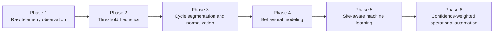
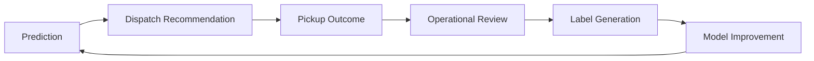

# Chapter 07: Model Evolution - The System Was Not Built All at Once

The final platform did not emerge from a single machine-learning breakthrough. It evolved iteratively through operational exposure, failed assumptions, telemetry analysis, and real-world deployment feedback.

The project progressed through **multiple generations of increasing sophistication**.

## 7.1 Raw Telemetry Observation

The earliest stage focused on a simple question:

> "Does compactor electrical behavior visibly change as fullness increases?"

Initial deployments primarily collected **current draw**, **runtime duration**, **operational timestamps**, and **basic activity patterns**. At this stage, the goal was **observational rather than predictive**.



Each phase solved one layer of ambiguity while simultaneously exposing deeper complexity underneath.

**Early patterns quickly emerged:**
- Empty compactors produced short stable cycles.
- Fuller compactors generated longer sustained resistance.
- Repeated crushes often correlated with approaching capacity.

The initial insight was confirmed: **the signal existed**. But it was still noisy, inconsistent, and operationally unreliable.

## 7.2 Rule-Based Thresholds

The first predictive logic relied heavily on **heuristics**. Simple thresholds were introduced around cycle duration, current draw, repeated runtime, and cycle frequency.

```text
IF: runtime > threshold
AND repeated cycles increase
THEN: likely approaching fullness
```

This worked surprisingly well in controlled deployments. However, limitations appeared almost immediately.

**False positives emerged from:**
- Dense material
- Construction debris
- Irregular operator behavior
- Compactor-specific variance

> One construction deployment repeatedly generated three high-load cycles that triggered approaching-fullness classifications under threshold logic. Several cycles later, resistance collapsed as structural debris shifted and compacted. These repeated misses highlighted the weakness of isolated threshold triggers and accelerated the move toward persistence-aware modeling.

A threshold that worked on one compactor failed on another. The project began moving away from "global rules" toward **"behavioral interpretation."**

## 7.3 Cycle Segmentation and Signal Processing

The next major evolution introduced **structured signal processing**. Instead of analyzing telemetry as a continuous stream, the system began isolating individual crush cycles, startup behavior, sustained-load windows, and resistance timing.

**This phase introduced:**
- Noise reduction
- Cycle segmentation
- Waveform normalization
- Temporal event analysis

> In several sparse-history deployments, similar waveform shapes produced inconsistent outcomes because baseline context was still immature. That ambiguity exposed the limits of deterministic interpretation and directly informed later confidence-scoring logic.

The startup spike problem became especially important. Without segmentation, the system could misinterpret motor activation as fullness resistance.

```text
Raw Electrical Stream
    -> Detect Active Compaction
    -> Segment Individual Cycle
    -> Remove Startup Distortion
    -> Analyze Resistance Behavior
```

This dramatically improved signal quality. The system was no longer measuring generic electrical activity; it was **modeling operational phases inside the crush cycle itself**.

## 7.4 Device Fingerprinting

One of the largest breakthroughs came after recognizing that **every compactor behaves differently**.

This phase introduced compactor-specific normalization. The platform began building baseline operational profiles for each machine.

**The system learned:**
- Normal empty-state behavior
- Expected runtime distributions
- Startup signatures
- Historical resistance patterns

The prediction logic shifted from:

> "Does this cycle exceed a global threshold?"

to:

> "Is this cycle abnormal relative to this compactor's own historical behavior?"

This dramatically reduced false positives. The platform effectively created **a behavioral fingerprint for every deployed asset**.

## 7.5 Site-Type Segmentation

The next major realization was that **waste stream behavior mattered as much as machine behavior**.

The platform began grouping deployments by operational context. Different site types produced different telemetry characteristics:

| Site Type | Characteristics |
| --- | --- |
| Apartment / Office | Smooth, consistent, predictable |
| Industrial | Dense materials, sudden spikes, irregular patterns |
| Construction | Temporary wedge resistance, structural collapse patterns |
| Hospitality | Occupancy-driven surges, seasonal volatility |

Construction environments were especially difficult because dense debris could create temporary resistance patterns that resembled full compactors.

This was a major transition from **compactor modeling** to **operational-environment modeling**.

## 7.6 Behavioral Trend Modeling

The platform eventually evolved beyond isolated-cycle analysis. **Historical sequence behavior** became increasingly important.

The model began tracking trend progression, resistance acceleration, cycle clustering, behavioral drift, and fullness trajectories over time.

Instead of asking:

> "Is this cycle full?"

The platform increasingly asked:

> "Is this compactor trending toward a known high-resistance operational state?"

This improved prediction stability, early-warning capability, and anomaly interpretation. **The system became more predictive and less reactive.**

## 7.7 Confidence Scoring

As deployments expanded, **operational trust became critical**. Predictions needed uncertainty handling.

The platform introduced confidence-weighted inference incorporating telemetry stability, historical consistency, site-type reliability, waveform quality, and known anomaly patterns.

| Confidence Level | Operational Action |
| --- | --- |
| High | Automated dispatch |
| Medium | Account manager review |
| Low | Manual monitoring required |

This allowed the system to support automation where reliability was high, and human review where ambiguity remained.

> The platform was no longer pretending certainty where uncertainty existed.

This was an important operational maturity milestone.

## 7.8 Operational Feedback Integration

The next evolution connected the ML system directly into operational workflows. The platform began continuously learning from haul confirmations, dump records, account-manager review, operational corrections, and dispatch outcomes.

This transformed the architecture into a **true closed-loop learning system**:



The operational business itself became part of the learning pipeline. This was one of the defining transitions from "telemetry platform" to "continuously improving industrial intelligence system."

## 7.9 Automation Readiness

As confidence improved, the platform increasingly supported **operational automation**. The system evolved toward predicted haul timing, autonomous dispatch recommendations, exception escalation, and reduced manual monitoring.

At this stage, the value proposition shifted significantly. The platform was no longer simply monitoring compactors or visualizing telemetry. It was actively influencing hauling schedules, operational efficiency, invoice quality, and dispatch timing.

The learning layer became operational infrastructure.

## 7.10 The Most Important Evolution

The deepest evolution was **conceptual**.

The project began as:

> "Can telemetry estimate fullness?"

It evolved into:

> "Can industrial behavior be modeled as an operational intelligence system?"

That shift changed the architecture, the modeling strategy, the labeling system, and the business value. The platform increasingly learned behavior, rhythm, resistance, anomaly, drift, and operational consequence.

The compactor stopped being treated as a static mechanical asset. It became **a continuously modeled behavioral system**.

## 7.11 Why This Matters

Real industrial ML systems rarely emerge fully formed. They evolve through observation, operational exposure, failure analysis, feedback loops, and iterative refinement.

The platform improved because:
- Every deployment exposed new edge cases.
- Every false prediction revealed missing context.
- Every operational interaction generated new learning opportunities.


The final system was not a single model. It was **the accumulated result of telemetry engineering, signal processing, operational learning, behavioral normalization, and continuous refinement across real industrial environments**.

That iterative evolution is what transformed the project from "remote monitoring" into "machine-learning-driven operational intelligence."

*Previous: [06 — Ground Truth & Labeling](06_Ground_Truth_and_Labeling.md) | Next: [08 — Failure Cases](08_Failure_Cases.md)*
