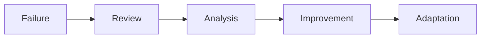

# Chapter 08: Failure Cases - Failure Was Part of the Learning Process

One of the defining characteristics of the platform was that it operated inside noisy, unpredictable physical environments. This meant failures were unavoidable.

The system was not modeling deterministic software behavior. It was modeling machinery, material resistance, human interaction, environmental drift, and operational uncertainty.

> Failure cases were not edge conditions to be ignored. They became one of the most valuable sources of learning in the entire platform.

Many of the system's most important improvements emerged directly from incorrect predictions, false positives, ambiguous telemetry, and operational exceptions. The project matured because the failures exposed where simplistic assumptions broke down.

## 8.1 Construction Site False Positives

Construction deployments generated some of the most difficult telemetry patterns in the system.

Large structural debris often behaved differently from normal waste streams: framing material, drywall, metal scraps, pallets, rigid packaging, and demolition debris. These materials could temporarily create extreme compression resistance without the compactor actually being near full capacity.

> In one construction deployment, three consecutive crush cycles showed extreme resistance and triggered a near-full classification. Two cycles later, the waveform dropped sharply as wedged framing debris collapsed inward. Operational review showed the model had over-weighted short-run peak resistance. This incident pushed the system toward persistence-aware logic that required sustained resistance across a broader cycle window before escalation.

**A common failure pattern:**

```text
Cycle 1 -> Extreme resistance
Cycle 2 -> Extreme resistance
Cycle 3 -> Structural collapse
Cycle 4 -> Normal compression behavior
```

The initial models frequently interpreted these early resistance spikes as "full compactor" events. In reality, the material structure simply had not collapsed yet; **the compactor was resisting shape rather than volume**.

This revealed an important modeling lesson: **high resistance alone does not necessarily imply high fullness**.

The system eventually evolved persistence logic, repeated-cycle interpretation, and site-type segmentation specifically because of these failures.

## 8.2 Dense Material Misclassification

Certain materials naturally produced abnormal resistance signatures: wet cardboard, compacted paper, dense industrial waste, moisture-heavy refuse, and tightly packed construction material.

These waste streams generated prolonged crush cycles, elevated sustained load, and abnormal current behavior. The platform sometimes classified these conditions as nearing capacity even when significant volume remained.

> At one retail-adjacent site, a period of rain drove a wet-cardboard waste mix that produced prolonged load duration without proportional volume growth. Early logic interpreted the extended resistance curve as fullness acceleration. Pickup outcome review showed meaningful remaining capacity. This incident led to stronger feature balancing between duration, trend consistency, and recent material-pattern variance.

The model initially over-weighted sustained resistance and cycle duration. Over time, the system learned that **density and fullness are related, but not identical**.

This led to multi-feature balancing, historical trend weighting, and confidence reduction in unstable environments.

## 8.3 Operator-Induced Noise

Human behavior frequently distorted the telemetry. Examples included repeated unnecessary crushes, operators "topping off" compactors, accidental cycle triggering, and inconsistent operational habits.

In some locations, staff routinely activated extra crush cycles regardless of fullness. This produced telemetry resembling urgency, repeated resistance, or abnormal compaction frequency.

> At one property, repeated back-to-back cycles appeared every evening just before shift handoff. The model treated this burst pattern as urgency. Operational interviews later confirmed an operator habit of running extra cycles regardless of fullness. The incident added cadence-normalization logic and reduced confidence for habit-driven burst signatures.

**Comparison:**

| Site Type | Daily Pattern |
| --- | --- |
| Normal site | 1-2 crushes per interval |
| Noisy site | 6-10 repeated crushes without corresponding fullness growth |

The model eventually learned behavioral cadence, user rhythm, and historical operating patterns to separate **operational necessity** from **operational habit**.

## 8.4 Mechanical Drift

Compactors changed behavior over time. Hydraulic systems aged. Motors degraded. Electrical characteristics drifted. Maintenance events altered runtime characteristics.

A compactor that once produced stable smooth cycles could later produce erratic resistance curves, longer runtimes, or inconsistent startup behavior.

This created a subtle but dangerous failure mode: **the model could incorrectly interpret mechanical degradation as increasing fullness**.

> One compactor exhibited steadily increasing runtime duration over several weeks and was repeatedly classified as escalating fullness pressure. After hydraulic service, average cycle duration dropped abruptly and returned near historical norms. Review showed much of the prior signal shift came from mechanical wear rather than true capacity growth. This incident reinforced maintenance-aware baseline resets and post-service recalibration windows.

The system eventually incorporated moving baselines, rolling historical windows, and drift-aware normalization to reduce these false interpretations.

## 8.5 Sparse Data Environments

Some deployments lacked sufficient historical telemetry: when devices were newly installed, telemetry was intermittent, sites had low usage frequency, or equipment remained idle for extended periods.

Without enough historical context, the platform struggled to establish reliable empty-state baselines, normal cycle distributions, and stable behavioral fingerprints.

This created **low-confidence prediction environments**.

This forced the system to evolve confidence scoring, onboarding periods, and gradual baseline stabilization logic. The platform learned that **prediction quality depended heavily on behavioral history depth**.

## 8.6 Delayed Operational Labels

Operational feedback was often delayed or inconsistent. A compactor could appear full, remain unserviced for days, then suddenly receive pickup.

**A typical ambiguous sequence:**

| Day | Event |
| --- | --- |
| Monday | Model predicts near full |
| Tuesday | No pickup |
| Wednesday | Overflow begins |
| Thursday | Vendor services compactor |

Was the model early, correct, or late? Operational labels rarely provided perfectly aligned answers.

The system therefore learned from **probabilistic operational outcomes** rather than exact deterministic labels.

## 8.7 Connectivity and Missing Telemetry

Industrial telemetry systems operate in imperfect network environments. Some deployments experienced cellular interruptions, delayed uploads, partial event loss, or intermittent device connectivity.

Missing telemetry introduced uncertainty into cycle frequency, trend progression, and fullness estimation.

> In one overflow incident, intermittent connectivity delayed uploads during a period of rapidly increasing load. By the time buffered events were reconstructed, service timing had already slipped. The model had not failed because resistance was absent; it failed because telemetry continuity was broken at a critical decision window. This event reinforced degraded-confidence handling, buffering safeguards, and delayed-data reconstruction logic.

The platform eventually required ingestion buffering, missing-data tolerance, and degraded-confidence handling. The system learned to distinguish between **abnormal compactor silence** and **simple connectivity interruption**.

## 8.8 False Negatives

False negatives were operationally dangerous. A false negative occurred when the platform underestimated fullness and a compactor approached overflow without recommendation.

These failures directly impacted customer trust, operational confidence, and service reliability.

**Causes included:**
- Weak historical baselines
- Irregular usage surges
- Occupancy spikes
- Unexpected material behavior

False negatives forced the system toward conservative escalation, confidence-aware automation, and earlier trend detection. Operationally, **avoiding overflow carried higher importance than maximizing every possible haul optimization**.

## 8.9 Overconfidence

One of the most important lessons was recognizing uncertainty itself.

Early modeling approaches sometimes behaved too deterministically: attempting to classify environments where signal quality was poor, history was sparse, or behavior was inherently unstable. This created overconfidence failures.

The platform eventually evolved confidence scoring, anomaly flags, review escalation paths, and uncertainty-aware recommendations.

> Some environments should not be fully automated.

This was an important maturity milestone. The platform became more trustworthy once it acknowledged ambiguity explicitly.

## 8.10 Failure Analysis Improved the System

Every failure exposed missing features, weak assumptions, poor segmentation, or insufficient context.

**Failures drove improvements in:**
- Site segmentation
- Temporal modeling
- Feature engineering
- Confidence scoring
- Normalization
- Operational review workflows



The system improved because real industrial behavior continuously challenged simplistic assumptions.

## 8.11 The Most Important Lesson

The project demonstrated an important reality about industrial machine learning:

> Physical systems rarely produce perfect signals. The challenge is not eliminating uncertainty. The challenge is **managing uncertainty intelligently enough to support operational decisions**.

The system succeeded not because it never failed. It succeeded because failures were observable, operational feedback existed, and **the platform continuously adapted**.

That adaptive learning loop is what transformed the project from "telemetry monitoring" into "resilient operational intelligence."

The failure cases were not evidence the approach was weak. They were evidence that the system was operating against real-world industrial complexity rather than artificial laboratory conditions.

*Previous: [07 — Model Evolution](07_Model_Evolution.md) | Next: [09 — Signal Drift](09_Signal_Drift.md)*
