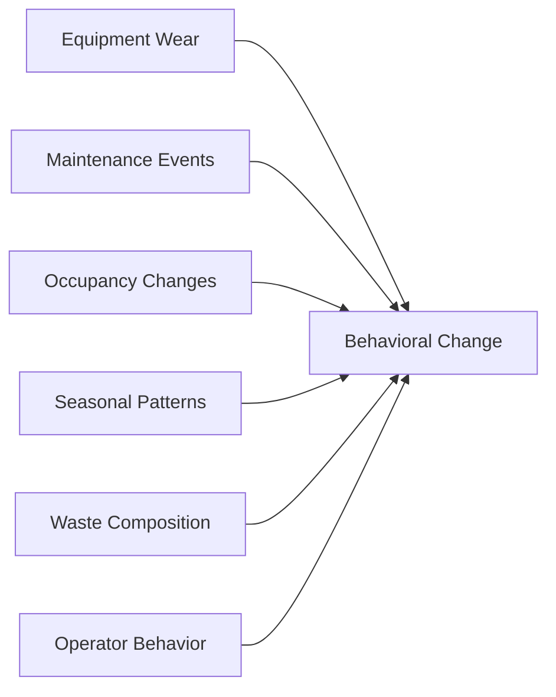
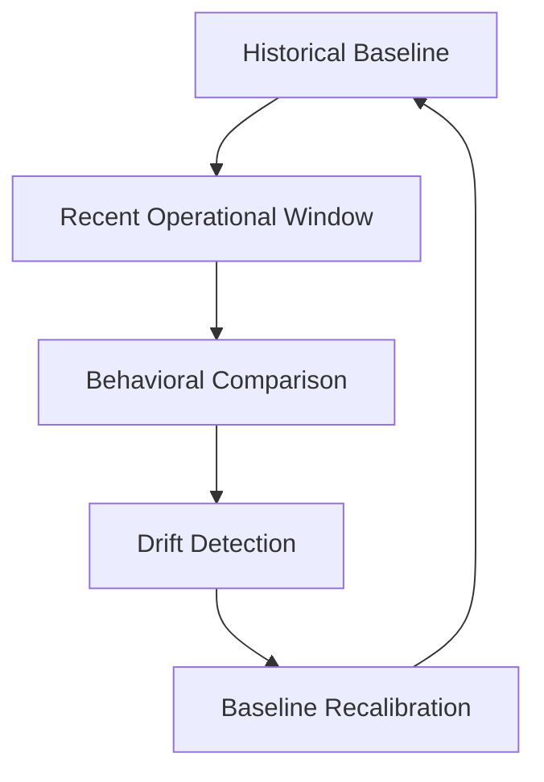

# Chapter 09: Signal Drift - Physical Systems Do Not Stay Still

One of the most important realities of the platform was that compactor behavior **continuously changed over time**.

The project was not solving a static classification problem. It was operating against physical machinery, changing environments, evolving waste streams, and fluctuating human behavior.

This introduced a major systems-engineering challenge: **the meaning of the signal itself drifted over time**.

A compactor that produced stable "full" signatures in one month could produce noticeably different behavior several months later. Without drift handling, model quality degraded steadily.

The system therefore had to treat **adaptation as a permanent architectural responsibility** rather than a one-time training exercise.

## 9.1 Drift Emerged From Multiple Sources

Signal drift rarely came from a single cause. Instead, it emerged from interacting operational factors.

| Source | Effect |
| --- | --- |
| **Equipment wear** | Altered cycle duration, resistance timing |
| **Maintenance events** | Abrupt behavioral resets |
| **Occupancy changes** | Different compaction frequency and volume |
| **Seasonal patterns** | Changed waste composition and density |
| **Waste composition** | Different resistance characteristics |
| **Operator behavior** | Evolving cadence and usage habits |

> The telemetry was not merely noisy. It was **continuously evolving**.

## 9.2 Equipment Wear Changed the Signal

Industrial compactors aged over time. Hydraulic systems degraded. Motors behaved differently under wear. Mechanical resistance changed gradually across months or years of operation.

These changes altered cycle duration, startup behavior, compression timing, and sustained-load characteristics.

A compactor that originally compressed material quickly might later require longer sustained load, slower cycle completion, or repeated crush attempts.

- **Month 1:** Stable short cycles
- **Month 6:** Longer compression duration
- **Month 12:** Higher runtime variance and altered resistance timing

Without recalibration, the model could incorrectly interpret normal equipment aging as increasing fullness.

> One compactor exhibited month-over-month runtime elongation and longer sustained-load windows that initially appeared to indicate accelerating fullness pressure. Field review later identified progressive hydraulic wear as a primary cause. The signal reflected real mechanical change, but not proportional capacity growth. This incident strengthened separation between mechanical drift indicators and fullness trend features.

The platform therefore needed rolling baselines, moving historical windows, and continuous normalization updates.

## 9.3 Maintenance Events Could Reset Behavioral Patterns

Maintenance introduced another difficult challenge. Repairs could **abruptly change telemetry behavior**.

Examples included hydraulic servicing, motor replacement, electrical repair, pressure recalibration, and compaction system adjustments. A single maintenance event could significantly alter runtime duration, load curve shape, startup behavior, and resistance distribution.

| Period | Observed Average Cycle Duration |
| --- | --- |
| **Before maintenance** | **12 seconds** |
| **After hydraulic repair** | **8 seconds** |

To a static model, this appeared as a sudden operational anomaly or dramatic fullness reduction. In reality, **the compactor had simply returned to healthier operating behavior**.

> In one post-service case, runtime behavior shifted abruptly back toward earlier norms within days of hydraulic repair. Without maintenance-aware handling, the model interpreted the reset as an anomaly rather than a restoration. This incident reinforced maintenance-tagged recalibration windows and temporary confidence suppression after major service events.

The platform eventually evolved drift-aware normalization, maintenance-aware recalibration, and rolling baseline reconstruction to absorb these operational changes safely.

## 9.4 Occupancy Changes Altered Usage Patterns

Commercial properties rarely maintain stable utilization forever. Occupancy changes dramatically influenced compactor behavior.

Examples included:

- Apartment move-in periods
- Student housing seasonality
- Retail traffic spikes
- Hospitality occupancy surges
- Tenant turnover

These shifts altered compaction frequency, waste volume, fullness acceleration, and operational cadence.

The same compactor could therefore behave like two different systems depending on operational context:

| Operational Dimension | Stable Occupancy | Turnover Period |
| --- | --- | --- |
| Cycle rhythm | Predictable daily cycle rhythm | Irregular high-volume disposal |
| Fullness trend | Steady fullness progression | Rapid fullness escalation |
| Resistance behavior | Stable resistance growth | Unstable cycle timing |

The platform needed **temporal awareness** rather than static thresholds.

## 9.5 Seasonal Waste Behavior Was Significant

Seasonality introduced additional drift. Different times of year produced noticeably different waste patterns.

Examples included:

- Holiday surges
- Student move-outs
- Tourism fluctuations
- Weather-related disposal changes
- Business-cycle variation

These patterns affected waste density, disposal frequency, and compaction resistance. For example, wet winter waste could compress differently than dry summer waste.

> A hospitality deployment showed sharp weekend resistance growth during peak season followed by rapid reversion during off-peak periods. Static thresholds alternated between overreaction and under-response across that seasonal boundary. The incident reinforced rolling baselines and stronger cadence weighting for occupancy-driven sites.

## 9.6 Waste Composition Drifted Over Time

The physical composition of the waste stream itself changed. This was one of the hardest drift factors because **the system never directly observed the material**.

Different material periods included cardboard-heavy periods, wet organic waste, demolition debris, packaging surges, and industrial scrap. These changes altered resistance timing, cycle duration, and waveform shape.

The system therefore needed to avoid overfitting to temporary material conditions.

## 9.7 Operator Behavior Drifted Too

Even human workflow patterns evolved. Examples included new staff, changed disposal habits, operational shortcuts, or repeated unnecessary crush behavior.

A site previously operating with 2-3 daily crushes might later exhibit frequent repeated compaction cycles, irregular activation timing, or inconsistent operational cadence.

This changed the meaning of cycle frequency, repeated resistance, and activity spikes. The system therefore tracked behavioral rhythm, cadence stability, and trend progression over time.

## 9.8 Drift Detection Became a Core System Capability

Over time, drift handling evolved into an explicit systems-engineering responsibility. The platform continuously monitored:

- Moving averages
- Cycle distributions
- Resistance onset timing
- Runtime variance
- Historical similarity windows

> The system increasingly focused on **relative change, not static values**.

**Recalibration was continuous.**

Rather than treating model training as "train once and deploy," the system operated more like "continuously adapt to changing industrial behavior."

Recalibration strategies included:

- Rolling historical windows
- Weighted recent behavior
- Confidence decay
- Anomaly escalation
- Baseline rebuilding after major drift events

High-confidence stable sites required minimal intervention. High-drift environments required more conservative automation, heavier human review, and increased normalization sensitivity.

## 9.9 Drift Was Not an Edge Case

> **Drift was not a failure condition. Drift was the normal operating state of physical systems.**

Industrial environments naturally evolve because machinery ages, people change behavior, operations fluctuate, and material composition shifts.

The system succeeded because it acknowledged this directly. The platform did not attempt to freeze the world into a static model. **It continuously adapted its interpretation of the signal over time.**

## 9.10 Why This Matters

Many machine-learning case studies implicitly assume stable environments, static data distributions, and unchanging operational behavior.

This project operated in the opposite environment. The telemetry continuously evolved. The meaning of the signal changed over time.

The system therefore required ongoing normalization, drift monitoring, recalibration, and adaptive behavioral interpretation.

This transformed the challenge from "training a model" into **"maintaining a continuously evolving industrial intelligence system."**

The machine-learning value did not come from fitting one good model once. It came from building a platform capable of **adapting to changing physical reality over long operational time horizons**.

    
<a href="README.md#table-of-contents">Table Of Contents</a>

    <a class="chapter-nav-prev" href="08_Failure_Cases.md">&larr; 08 - Failure Cases</a>
    <a class="chapter-nav-next" href="10_Operational_Integration.md">10 - Operational Integration &rarr;</a>

