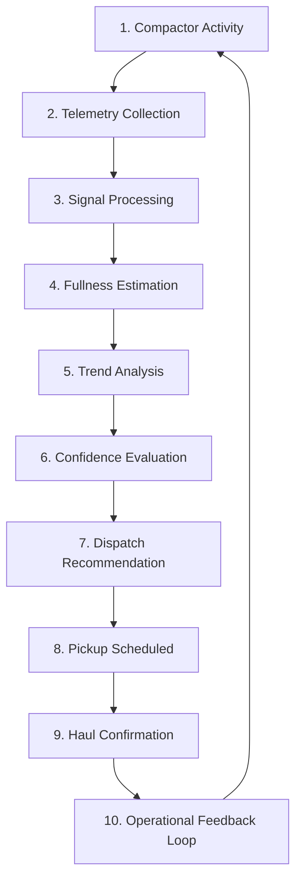
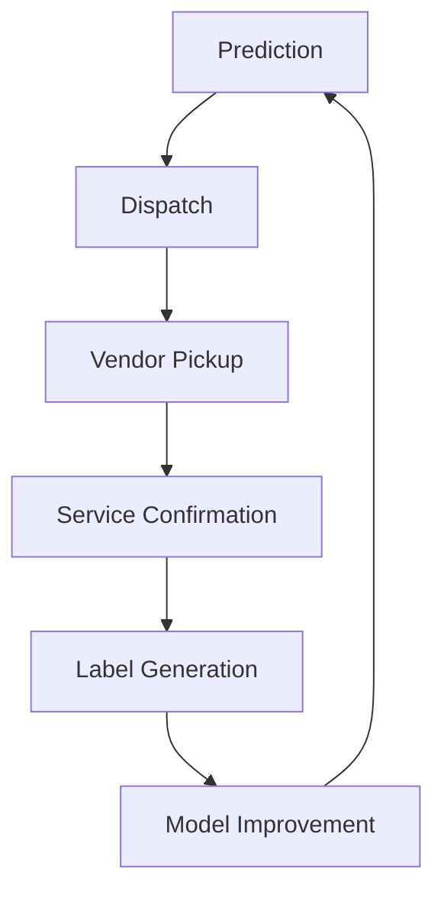

# Chapter 10: Operational Integration - The Value Was Operational, Not Analytical

The platform mattered because it changed real operational behavior.

The goal was never generating charts, visualizing telemetry, or producing abstract machine-learning scores. The goal was **operational decision-making**.

The system existed to answer practical questions such as:

- Should this compactor be serviced?
- Is this pickup premature?
- Is overflow likely?
- Is this vendor over-servicing?
- Is this site behaving abnormally?

The machine-learning layer only created value once it influenced dispatch timing, hauling efficiency, operational review, customer reporting, and service economics.

> The project evolved into an **operational intelligence platform**, not a telemetry dashboard.

## 10.1 The Dispatch Workflow

At the center of the system was the dispatch decision loop.

This closed-loop workflow connected physical machine behavior, machine-learning inference, and real-world hauling operations.

> The prediction itself was not the endpoint. The operational decision was the endpoint.

## 10.2 Condition-Based Hauling

Traditional hauling systems often relied on fixed schedules, route assumptions, or reactive overflow response.

The platform introduced **condition-based servicing**.

Instead of: *"service every Tuesday,"*  
the system moved toward: *"service when operational behavior indicates approaching capacity."*

This created several operational advantages:

- Reduced unnecessary hauls on under-filled compactors
- Earlier intervention when behavior indicated accelerating fill
- Better alignment between service timing and actual utilization
- Reduced overflow risk through behavioral trend awareness

The platform effectively transformed hauling from **schedule-driven operations** into **data-informed operations**.

## 10.3 Dispatch Recommendations

The system generated operational recommendations based on fullness estimation, trend acceleration, resistance behavior, confidence scoring, and historical site patterns.

Recommendations included:

- Approaching capacity alerts
- Service-threshold notifications
- Abnormal resistance escalation
- Repeated-cycle exception warnings

> High confidence + sustained resistance growth + repeated crush behavior -> recommend service dispatch.

However, the platform did not assume every prediction should trigger automation. Confidence-aware review remained important in ambiguous environments.

> During a major event weekend at one hospitality site, overnight crush activity accelerated sharply and the fullness projection rose quickly. Confidence remained moderate because that location had historically volatile occupancy-driven behavior. The system escalated to account-manager review instead of issuing full automation. Early service was scheduled the next morning after manual confirmation.

## 10.4 Human Review and Account Management

Account managers became operational interpreters between telemetry, customer expectations, and vendor workflows.

The dashboard exposed:

- Compactor status
- Telemetry history
- Cycle trends
- Predicted fullness
- Service recommendations

This allowed operational teams to validate system recommendations, review unusual behavior, adjust thresholds, and escalate exceptions.

The interface effectively translated complex industrial telemetry into operationally understandable language.

Example dashboard concepts included:

- Current fill-state estimation
- Historical trend graphs
- Pickup recommendations
- Confidence indicators
- Recent crush-cycle summaries
- Device health status

> In another case, projected threshold crossing occurred before available vendor route capacity in that region. The dashboard tracked growing service risk while recommendation urgency increased over time. Post-event analysis used this timeline to separate model behavior from vendor scheduling constraints.

## 10.5 Exception Handling

The platform became especially valuable during operational anomalies.

Examples included:

- Unexpected resistance spikes
- Repeated failed crush attempts
- Overflow risk
- Abnormal inactivity
- Irregular site behavior

These events triggered alerts, escalation workflows, or manual operational review.

> Abnormal resistance pattern -> confidence reduced -> operational alert generated -> account manager review -> dispatch or monitoring decision.

This prevented the system from blindly automating uncertain conditions.

> One deployment triggered anomaly status from repeated resistance spikes that initially resembled urgent fullness. Manual review identified a temporary obstruction pattern that cleared after subsequent cycles. The exception workflow avoided an unnecessary dispatch while preserving trust in automated recommendations.

Operational exceptions became a core part of the workflow architecture.

## 10.6 Haul Confirmation Closed the Loop

Pickup completion became part of the operational intelligence cycle. Confirmed service events allowed the platform to validate predictions, refine historical patterns, and improve future recommendations.

> The platform continuously learned from the consequences of real dispatch decisions.

## 10.7 Invoice Auditing and Service Validation

One of the less obvious but strategically important operational applications was **invoice auditing and service validation**.

Because the system maintained telemetry history, compactor activity, and operational timelines, it became possible to compare claimed service activity against observed operational behavior.

This created opportunities for:

- Identifying unnecessary pickups
- Validating service frequency
- Reviewing abnormal haul patterns
- Improving vendor accountability

Example operational questions:

- Was this pickup operationally justified?
- Was the compactor actually approaching capacity?
- Did haul frequency align with telemetry behavior?
- Was the service schedule oversized for this location?

The system therefore evolved beyond compactor monitoring. It became part of **operational auditing, service optimization, and waste-program management**.

## 10.8 Reporting and Operational Visibility

The platform centralized operational reporting across distributed assets.

The reporting layer provided visibility into:

- Compactor activity
- Fullness trends
- Service timing
- Device health
- Exception frequency
- Operational utilization

For distributed enterprise environments, this created something many customers previously lacked: **nationwide operational visibility across waste infrastructure**.

Organizations could now evaluate which locations required frequent service, which sites were over-serviced, where operational anomalies occurred, and how waste behavior changed over time.

The telemetry became a **management layer for distributed physical infrastructure**.

## 10.9 Operational Segmentation

The system eventually adapted workflows based on site characteristics. Different environments required different operational logic.

| Site Type | Automation Level | Review Cadence |
| --- | --- | --- |
| Stable residential | Higher automation | Periodic review |
| Industrial / construction | Conservative automation | Frequent review |
| Hospitality | Occupancy-aware | Event-triggered review |
| Sparse history / new sites | Manual + monitored | Intensive onboarding |

This operational segmentation improved dispatch quality, trust, and automation reliability. The platform increasingly combined **machine learning with operational policy logic**.

## 10.10 The Dashboard Was an Operational Tool

An important architectural realization was that **the dashboard itself became part of the machine-learning system**.

It enabled human review, label generation, operational correction, and workflow integration. The interface was not simply visualization software; it was part of the operational feedback loop.

This is what allowed the platform to continuously improve under real deployment conditions.

## 10.11 Automation Was Introduced Gradually

The system did not immediately jump to full automation. Operational trust had to be earned progressively.

- Telemetry visibility
- Operational recommendations
- Decision support
- Semi-automated dispatch
- Confidence-aware automation

This gradual progression was important because industrial operations require reliability, explainability, and operational confidence.

> The platform succeeded because it augmented operational workflows rather than attempting to abruptly replace them.

## 10.12 The Most Important Operational Shift

The project fundamentally changed the relationship between physical infrastructure, operational management, and data systems.

| Before | After | Operational Meaning |
| --- | --- | --- |
| Compactors were mostly opaque assets | Compactor behavior became observable | Asset state moved from hidden to measurable |
| Dispatch was largely reactive | Operational trends became measurable | Teams could act earlier using trend signals |
| Service timing depended on heuristics | Hauling decisions became data-informed | Scheduling aligned more closely to real utilization |

The machine-learning system transformed industrial telemetry into **operational workflow intelligence**.

## 10.13 Why This Matters

The value did not come from a model score or a waveform classification. The value emerged because the platform integrated directly into dispatch operations, hauling decisions, vendor coordination, account management, invoice auditing, reporting, and operational review.

> The machine-learning layer mattered because it changed how the business operated.

That operational integration is what transformed the project from "industrial telemetry" into "production operational intelligence."

    
<a href="README.md#table-of-contents">Table Of Contents</a>

    <a class="chapter-nav-prev" href="09_Signal_Drift.md">&larr; 09 - Signal Drift</a>
    <a class="chapter-nav-next" href="11_Nationwide_Scale.md">11 - Nationwide Scale &rarr;</a>

