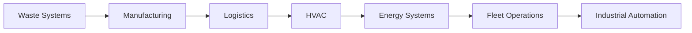
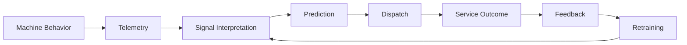

# Chapter 13: Strategic Significance
## The Project Was About More Than Waste Operations

At the surface level, the platform solved a commercial waste problem: predicting compactor fullness, improving dispatch timing, and reducing operational inefficiency.

But the broader significance of the project extended far beyond compactors.

The system demonstrated a much larger principle:

> **Ordinary industrial infrastructure already contains hidden operational intelligence. The challenge is often not installing more sensors or collecting more data. The challenge is learning how to interpret the signals systems already produce.**

This became the foundational insight behind the platform.

## 13.1 The Compactor Became an Instrument

Traditional industrial systems often treat machinery as passive equipment with limited operational visibility.

This project treated industrial infrastructure differently. **The compactor itself became a sensing mechanism, a behavioral signal source, and an operational intelligence asset.**

The system extracted meaning from electrical behavior, resistance patterns, timing characteristics, and operational rhythm. No direct fill sensor existed. No camera observed the waste. No lidar mapped internal geometry.

Instead, the platform interpreted **the machine's response to physical reality**.

That distinction is strategically important. The project demonstrated that **machine behavior itself can become telemetry**.

## 13.2 The Broader Industrial AI Thesis

The project effectively became an early industrial AI system before "industrial AI" became mainstream terminology.

The architecture combined telemetry, time-series analysis, behavioral modeling, operational feedback, and machine-learning inference to create automated operational decision systems.

**The broader thesis can be stated simply:**

> Industrial systems continuously emit signals.
>
> Machine learning can convert those signals into operational intelligence.

This principle extends far beyond waste operations. Similar approaches can apply to manufacturing equipment, logistics systems, HVAC infrastructure, energy systems, pumps and compressors, fleet operations, and industrial automation environments.

The project demonstrated that **hidden operational state can often be inferred indirectly from machine behavior**.

## 13.3 The System Modeled Behavior, Not Just Data

One of the most important strategic aspects of the platform was that it modeled behavior, drift, rhythm, resistance, and operational change.

This moved the project beyond traditional IoT telemetry collection. The platform was not merely recording events. It was interpreting physical interaction, operational stress, and changing environmental conditions.

That distinction matters because **many IoT systems fail to generate meaningful operational leverage**.

> Collecting telemetry alone rarely creates business value.
>
> **Interpreting telemetry operationally is what creates value.**

## 13.4 Operational Intelligence Became the Product

The real product was never the telemetry device or the dashboard.

> **The real product was operational intelligence.**

The system transformed noisy machine behavior into actionable operational decisions, including dispatch recommendations, service optimization, anomaly detection, utilization awareness, and operational visibility.

The value emerged because **the intelligence loop connected directly into real operational workflows**.

## 13.5 The Platform Demonstrated Commercial Viability

An important aspect of the project is that the concepts did not remain theoretical.

Publicly visible operational evolution associated with Quest Resource Holding Corporation and related waste-technology initiatives emphasized centralized waste intelligence, IoT-enabled infrastructure, data-driven waste operations, predictive service workflows, and AI-assisted operational management.

The broader commercialization path validated that operational telemetry, machine-learning-assisted dispatch, and centralized infrastructure visibility were commercially meaningful capabilities.

The significance is not merely that a prototype existed. The significance is that **the operational thesis proved durable enough to integrate into larger commercial waste-management ecosystems**.

## 13.6 This Was an Early Applied ML Infrastructure System

The project also matters historically in the context of applied machine learning.

Many modern AI narratives focus heavily on generative systems, conversational interfaces, or digital content generation.

This project represented a different class of AI system: **industrial inference, operational optimization, and physical-world modeling**.

The platform operated against real machinery, real operational costs, real deployment variability, and real financial consequences.

This is a fundamentally harder environment than many purely digital ML systems because:

- Signals drift
- Labels are noisy
- Environments evolve
- Operational mistakes carry physical consequences

The platform therefore demonstrated **machine learning as operational infrastructure, not merely analytical experimentation**.

## 13.7 The Most Important Insight

Perhaps the most important strategic insight was this:

> **The physical world is already generating telemetry. The opportunity is learning how to interpret it.**

Many industrial systems already expose electrical behavior, thermal signatures, timing patterns, resistance changes, and operational rhythm.

Historically, these signals were ignored because they were noisy, difficult to model, and operationally ambiguous.

Machine learning changed that equation. The platform demonstrated that **software could make hidden physical behavior legible**.

## 13.8 The Closed-Loop Learning System Was the Moat

The strongest long-term strategic advantage was not a single model.

It was the **closed-loop operational learning architecture**:

This created continuously improving operational intelligence. The dataset became increasingly valuable because it combined physical behavior, operational workflows, human review, and real-world outcomes.

That feedback loop is what transformed the project from telemetry software into **adaptive industrial intelligence infrastructure**.

## 13.9 Why This Matters Beyond Waste

The significance of the project is broader than waste management. The platform demonstrated a **repeatable industrial AI pattern**:

1. Identify industrial systems that already emit behavioral signals.
2. Design telemetry infrastructure to capture those signals reliably.
3. Build signal-processing and normalization layers.
4. Apply behavioral modeling to infer operational state.
5. Connect predictions into operational workflows.
6. Learn continuously from real-world outcomes.

This pattern is applicable across logistics, manufacturing, utilities, facilities management, industrial automation, and smart infrastructure systems.

**The compactor was simply the first expression of the idea.**

## 13.10 Closing Synthesis

The project ultimately demonstrated that **industrial intelligence does not always require new infrastructure**.

> Sometimes the infrastructure already exists. The signals already exist. The operational patterns already exist.
>
> What is missing is the ability to interpret them.

By modeling electrical behavior, resistance, timing, drift, and operational outcomes, the platform transformed ordinary compactors into observable industrial systems capable of participating in machine-learning-driven operational decision-making.

The project was never fundamentally about trash compactors.

> It was about proving that **hidden signals inside physical infrastructure can be converted into operational intelligence systems at scale**.

That principle extends far beyond waste operations. It represents a broader shift toward machine learning as a foundational layer for interpreting and orchestrating the physical world.

    
<a href="README.md#table-of-contents">Table Of Contents</a>

    <a class="chapter-nav-prev" href="12_Business_Outcome.md">&larr; 12 - Business Outcome</a>
    <a class="chapter-nav-next" href="14_Appendix_A.md">14 - Appendix A: Public Evidence &rarr;</a>

