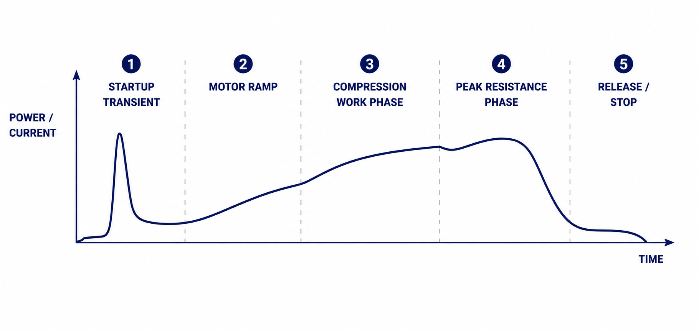
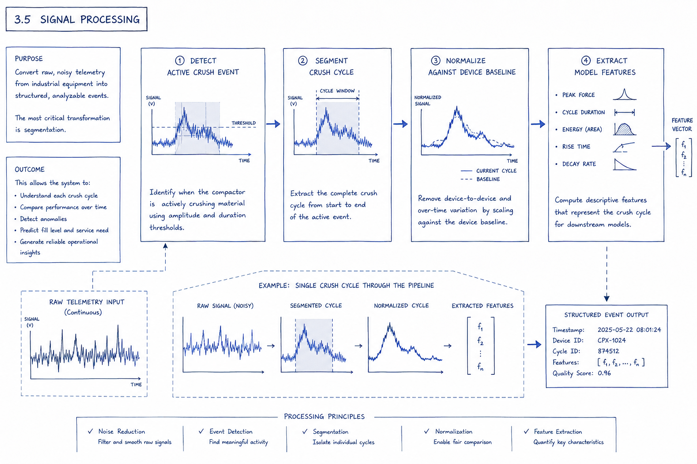
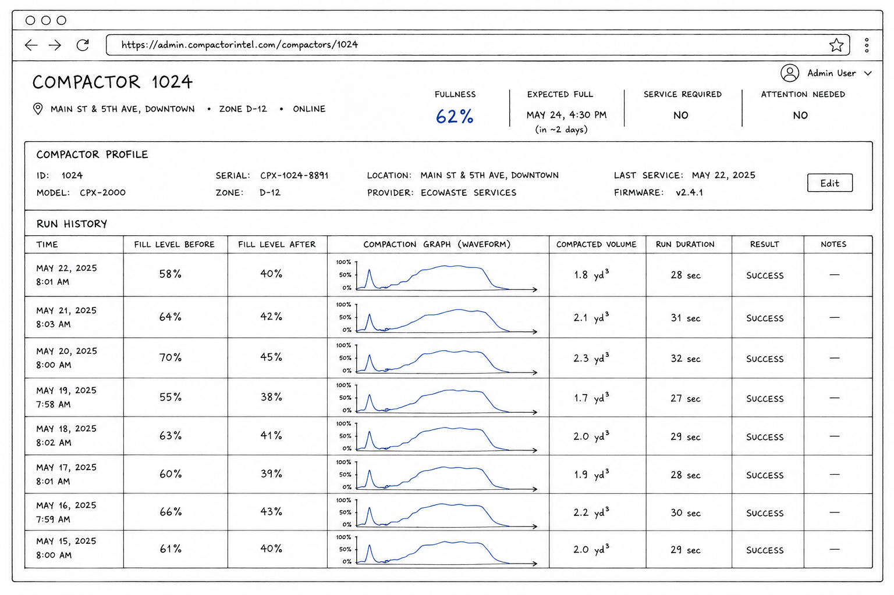
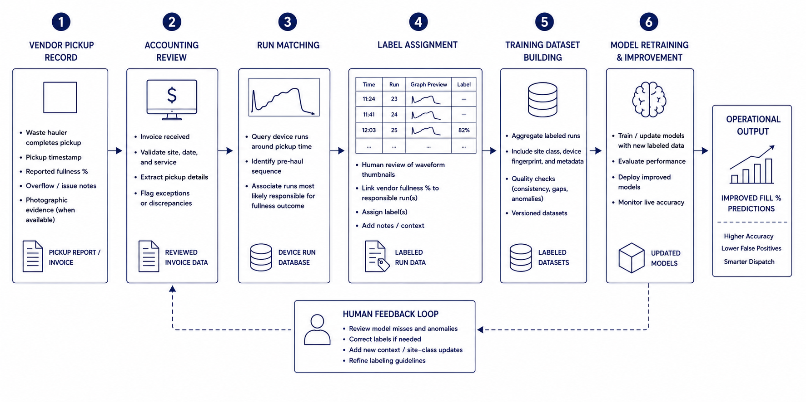

# Assets Index

This index lists exported image assets, excluding tiny extraction artifacts.

Thumbnail constraints: max display size uses width="220" and height="140".

<table>
  <thead><tr><th>File</th><th>Thumbnail</th><th>Description</th><th>Sub Class</th><th>Class</th></tr></thead>
  <tbody>
    <tr><td>figure-illustration-waste-collection-architecture-overview.png</td><td></td><td>Overview of the waste collection system architecture and its main data flow.</td><td>Illustration</td><td>figure</td></tr>
    <tr><td>figure-illustration-compactor-hardware-city-scene.png</td><td></td><td>Compactor hardware in a city setting, showing underfilled, overflow-risk, and unknown states.</td><td>Illustration</td><td>figure</td></tr>
    <tr><td>figure-diagram-traditional-vs-sensor-comparison.png</td><td></td><td>Comparison of traditional waste monitoring approaches with the noninvasive electromagnetic sensor.</td><td>Diagram</td><td>figure</td></tr>
    <tr><td>figure-diagram-electromagnetic-sensor-telemetry-flow.png</td><td></td><td>Electromagnetic sensor telemetry flow showing how magnetic activity around the compactor cable is captured.</td><td>Diagram</td><td>figure</td></tr>
    <tr><td>figure-waveform-empty-compactor-crush-cycle.png</td><td></td><td>Baseline compactor crush-cycle waveform for an empty bin.</td><td>Waveform</td><td>figure</td></tr>
    <tr><td>figure-waveform-full-compactor-crush-cycle.png</td><td></td><td>Compactor crush-cycle waveform showing how peak load shifts as the bin fills.</td><td>Waveform</td><td>figure</td></tr>
    <tr><td>figure-diagram-device-fingerprint-comparison.png</td><td></td><td>Comparison of two compactors with distinct crush-cycle signatures, illustrating device-specific fingerprints.</td><td>Diagram</td><td>figure</td></tr>
    <tr><td>figure-diagram-compactor-feature-engineering.png</td><td></td><td>Compactor crush-cycle waveform broken into startup, motor ramp, compression, peak resistance, and release phases.</td><td>Diagram</td><td>figure</td></tr>
    <tr><td>style-style-element-quote-marker.png</td><td></td><td>Decorative quotation marker used to introduce pull quotes and callout text throughout the case study.</td><td>Style Element</td><td>style</td></tr>
    <tr><td>figure-diagram-fullness-inference-workflow.png</td><td></td><td>Workflow for inferring fullness from device-specific fingerprint classification.</td><td>Diagram</td><td>figure</td></tr>
    <tr><td>figure-diagram-empty-vs-full-waveform-overlay.png</td><td></td><td>Overlay of empty and full compactor waveforms showing how the signal changes across a crush cycle.</td><td>Diagram</td><td>figure</td></tr>
    <tr><td>figure-diagram-site-type-waveform-overlay.png</td><td></td><td>Overlay of two device waveforms at peak resistance, illustrating site-to-site signal variation.</td><td>Diagram</td><td>figure</td></tr>
    <tr><td>figure-diagram-end-to-end-model-evolution-workflow.png</td><td></td><td>End-to-end model evolution flow from compactor telemetry through feature engineering, inference, dispatch, and routing optimization.</td><td>Diagram</td><td>figure</td></tr>
    <tr><td>figure-diagram-iot-device-operational-workflow.png</td><td></td><td>IoT device workflow showing electromagnetic sensing, onboard processing, and cellular transmission.</td><td>Diagram</td><td>figure</td></tr>
    <tr><td>figure-diagram-nationwide-deployment-workflow.png</td><td></td><td>Nationwide deployment workflow from cloud ingestion through analytics and dashboard reporting.</td><td>Diagram</td><td>figure</td></tr>
    <tr><td>figure-diagram-signal-processing-normalization-workflow.png</td><td></td><td>Signal-processing workflow showing normalization and end-to-end operational flow.</td><td>Diagram</td><td>figure</td></tr>
    <tr><td>figure-mockup-business-outcome-dashboard.png</td><td></td><td>Dashboard concept used by account managers to label runs and map them to vendor-reported dump events.</td><td>Mockup</td><td>figure</td></tr>
    <tr><td>planning-mockup-executive-summary-pdf-draft.png</td><td></td><td>Design-time PDF mockup for the executive summary section of the case study.</td><td>Mockup</td><td>planning</td></tr>
    <tr><td>figure-diagram-human-feedback-loop.png</td><td></td><td>Human feedback-loop diagram showing how labeled data improves the inference engine.</td><td>Diagram</td><td>figure</td></tr>
    <tr><td>style-style-element-blueprint-compactor-cover.png</td><td></td><td>Cover-page background image with a blueprint-style compactor.</td><td>Style Element</td><td>style</td></tr>
  </tbody>
</table>
