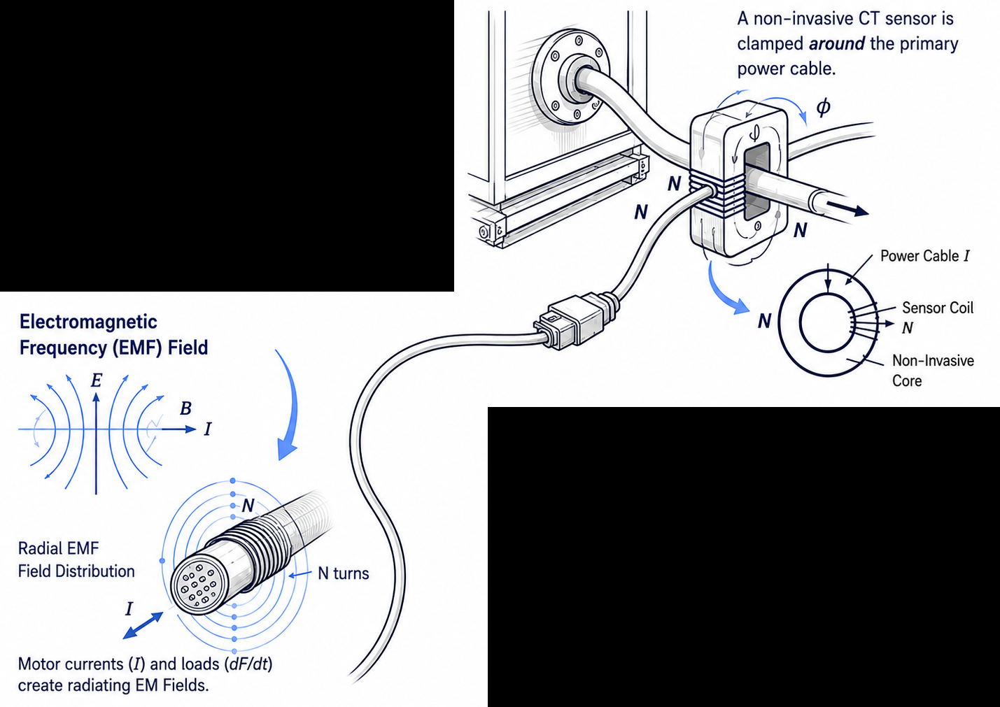

# Raw Payload Runs

*Back to [repository root](../README.md) · Related: [case study](../case-study/README.md) · Compare with [clean waveform benchmark](../clean_waveform_benchmark/README.md)*

## Purpose

This folder contains synthetic JSONL telemetry records modeled after the nested payload structure used in the compactor telemetry case study.

Use this dataset when you want to test ingestion, decoding, anomaly handling, and raw-stream processing logic closer to payload-form telemetry than the clean benchmark provides.

## Contents

| File / folder | Purpose |
|---|---|
| `all_runs.jsonl` | Full generated record set in one file |
| `scenarios/*.jsonl` | One JSONL file per scenario family / edge case |
| `manifest.json` | Generation settings, scenario descriptions, and summary details |
| `schema.json` | Informal schema for the normalized record shape |
| `validation_summary.csv` | Quick validation and metric summary |
| `generate_mock_compaction_data.py` | Generator script used to produce the dataset |

## Scale

| Metric | Value |
|---|---|
| Total records | 726 |
| Usable sample count range | 18 to 214 |
| Records with split labels | 201 |
| Records with missing CSV value slots | 30 |

## Data shape

Each JSONL line contains these major blocks:

- `latest_message` — a close analogue of the application payload, including nested base64 CSV content
- `raw_stream` — decoded helper fields for inspection and derived processing
- `run` — normalized labels, split indices, metrics, and anomaly scenario tags
- `device` / `site` — stable mock metadata resembling the original device family without reproducing live operational records

The encoded stream follows the same general pattern:

1. timestamp line such as `2018/04/02,16:10:58`
2. comma-delimited sensor readings with a blank first token and an initial sync artifact
3. battery percentage line
4. signal-strength line

## What this dataset is good for

- Payload parser validation
- Base64 CSV decoding tests
- Double-run split detection
- Truncation, dropout, saturation, and weak-signal scenarios
- Raw-stream feature extraction before model training

## Recommended usage

For production-like parsing tests, decode `latest_message.data` exactly as your parser would in a live workflow.

For faster analysis workflows, use `raw_stream.decoded_values` after removing `None` gaps.

## Related documentation

- [Repository root](../README.md)
- [Case study README](../case-study/README.md)
- [Clean waveform benchmark README](../clean_waveform_benchmark/README.md)
